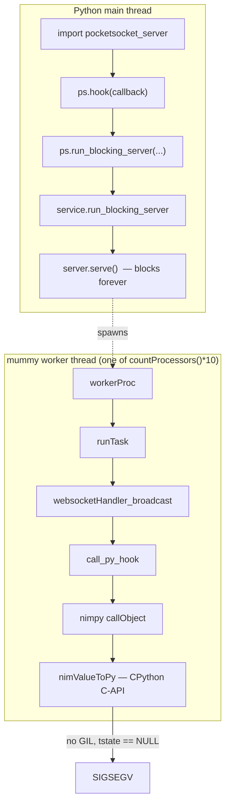
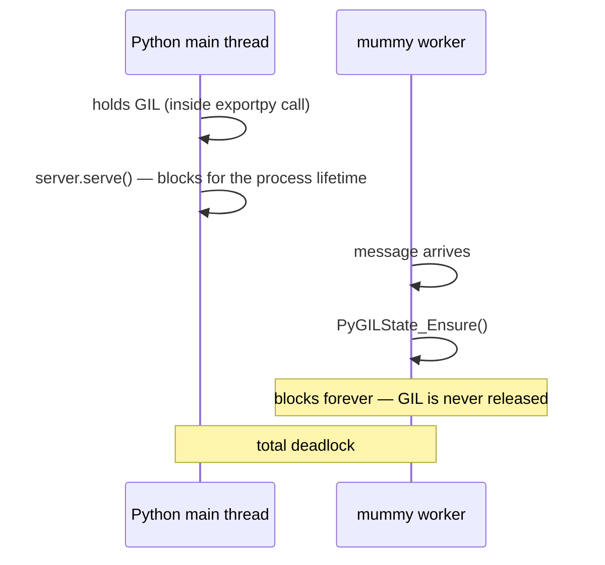

# Fixing the Python Callback Segfault: GIL Acquisition Across Nim Worker Threads

**Status:** Resolved
**Date:** 2026-08-05
**Affects:** `pocketsocket.hook()` — the Python callback API
**Supersedes:** `docs/BUGFIX_SEGFAULT.md` (incorrect diagnosis), `docs/PYTHON_CALLBACK_INVESTIGATION.md` (correct diagnosis, incorrect conclusion), `docs/THREADING_ISSUE.md`

---

## Table of Contents

1. [The Issue](#1-the-issue)
2. [Environment & Build Configuration](#2-environment--build-configuration)
3. [Prior Art: What the Existing Docs Got Right and Wrong](#3-prior-art-what-the-existing-docs-got-right-and-wrong)
4. [Discovery: Reproducing and Bisecting the Fault](#4-discovery-reproducing-and-bisecting-the-fault)
5. [Root Cause Analysis](#5-root-cause-analysis)
6. [Breaking the Catch-22](#6-breaking-the-catch-22)
7. [The Second Deadlock: `run_blocking_server` Never Yields the GIL](#7-the-second-deadlock-run_blocking_server-never-yields-the-gil)
8. [The Solution](#8-the-solution)
9. [Secondary Defects Found and Fixed](#9-secondary-defects-found-and-fixed)
10. [Concurrency Invariants (read this before refactoring)](#10-concurrency-invariants-read-this-before-refactoring)
11. [Verification](#11-verification)
12. [Performance Characteristics](#12-performance-characteristics)
13. [Known Limitations & Future Work](#13-known-limitations--future-work)
14. [Appendix A: Reproduction Harness](#appendix-a-reproduction-harness)
15. [Appendix B: Build Instructions](#appendix-b-build-instructions)

---

## 1. The Issue

Registering a Python callback via `pocketsocket.hook()` and then serving traffic
caused an immediate, deterministic `SIGSEGV` inside nimpy's marshalling layer.

```
Traceback (most recent call last)
mummy-0.4.8/mummy.nim(538)  workerProc
mummy-0.4.8/mummy.nim(511)  runTask
src/pocketsocketpkg/broadcast.nim(71)  websocketHandler_broadcast
nimpy-0.2.1/nimpy.nim(953)  call_py_hook
nimpy-0.2.1/nimpy/nim_py_marshalling.nim  nimValueToPy
SIGSEGV: Illegal storage access. (Attempt to read from nil?)
```

Critically, `broadcast.nim(71)` is the **`OpenEvent`** branch — the crash happened
on the WebSocket *upgrade*, before any application message was ever marshalled:

```nim
of OpenEvent:
  ...
  discard call_py_hook(websocket, event, message)   # <-- line 71, crash
```

The practical consequence: the entire Python-facing feature set of pocketsocket
was unusable. No echo server, no chat server, no throughput benchmarking of the
message path.

---

## 2. Environment & Build Configuration

| Component | Version |
| --- | --- |
| Nim | 2.2.10 (x86_64 Linux) |
| nimpy | 0.2.1 |
| mummy | 0.4.8 |
| CPython | 3.12.1 |
| libc | glibc (Ubuntu 24.04) |

`src/nim.cfg`:

```
threads = on
tlsEmulation = off
define = useMalloc
mm = arc
```

These flags matter to the analysis:

* **`threads = on`** — mummy spawns real OS threads; Nim's runtime is
  thread-aware and TLS-backed.
* **`tlsEmulation = off`** — Nim uses native `__thread` storage. This is required
  for correctness here because CPython's per-thread state also lives in native
  TLS; emulated TLS would have made the interaction far murkier to reason about.
* **`mm = arc`** — deterministic, non-cycle-collecting reference counting. Relevant
  because nimpy's `PyObject` is a `ref object` whose `=destroy` hook issues a
  CPython `Py_DECREF`. *When* that destructor fires therefore determines *when* a
  Python C-API call happens, which in turn determines whether we need the GIL held
  at that point. (See §10.)
* **`define = useMalloc`** — Nim allocates through libc rather than its own arena.
  Removes one class of "is this Nim's allocator or CPython's?" ambiguity when
  reading a crash address.

mummy's threading defaults (`mummy.nim:1476`):

```nim
workerThreads = max(countProcessors() * 10, 1)
```

and (`mummy.nim:1535`):

```nim
createThread(result.workerThreads[i], workerProc, result)
```

So on a typical dev box, **dozens** of native Nim threads may concurrently enter
`websocketHandler_broadcast`, and therefore `call_py_hook`.

---

## 3. Prior Art: What the Existing Docs Got Right and Wrong

The repository contained three prior write-ups. They are worth dissecting
individually, because one of them was *nearly* correct and its erroneous
conclusion is what left the bug unfixed.

### 3.1 `docs/BUGFIX_SEGFAULT.md` — wrong diagnosis, wrong fix

**Claim:** the segfault was caused by `MessageKind` (mummy's enum) lacking a
`nimpyEnumConvert` mixin, causing a nil dereference in:

```nim
proc nimValueToPy*(v: enum): PPyObject {.inline.} =
  mixin nimpyEnumConvert
  nimValueToPy(nimpyEnumConvert(v))
```

**Why this is false.** nimpy 0.2.1 ships a *generic default* implementation at
`nimpy/nim_py_marshalling.nim:6`:

```nim
# Enum handling
proc nimpyEnumConvert*[T](o: T): int =
  ## Default is ordinal integer
  ## User can freely overload any proc named `nimpyEnumConvert` ...
  ord(o)
```

The `mixin` keyword makes the symbol resolve at instantiation, and the generic
`[T]` overload always matches. `MessageKind` therefore marshals perfectly well as
an integer. No user overload is required.

Two further points falsify the diagnosis:

1. `mixin` resolution failure is a **compile-time** error in Nim, not a runtime
   nil dereference. A missing mixin cannot produce `SIGSEGV`.
2. The crash occurred on `OpenEvent`, where mummy passes a **default-constructed
   `Message`** (`kind = TextMessage`, `data = ""`). If enum marshalling were
   broken, that path would be no more or less broken than any other — but the
   document's proposed fix (converting `Message` to a dict by hand) leaves
   `event` as an enum in one variant of its own example and still would not have
   helped.

**Most damning:** the document was written as though the fix had been applied and
verified. It had not been. The fix described in "Files Modified" was never
committed — `hook.nim` on `main` still contained the original code verbatim:

```nim
let info:PyObject = pyHook.callObject(cast[uint64](hash(websocket)), event, message)
```

The document's "Impact ✅" checklist was aspirational, not observed.

### 3.2 `docs/PYTHON_CALLBACK_INVESTIGATION.md` — right diagnosis, wrong conclusion

This document is genuinely good analysis. It correctly identifies:

* mummy runs handlers on native worker threads;
* CPython requires the GIL to be held for *any* C-API call from a non-main thread;
* nimpy performs no GIL management whatsoever;
* therefore every marshalling call from a worker thread is undefined behaviour.

It then documents eight attempted fixes and correctly explains why attempts 1–7
(manual dicts, JSON, scalar-only arguments, Nim `Lock`s, `workerThreads=1`, a
dedicated hook thread with a `Channel`) all fail: **none of them acquire the
GIL**. A Nim `Lock` serialises Nim code; it does not make CPython's thread state
valid. A dedicated Nim thread is still not a Python thread.

The failure is in attempt 8 and the conclusion. The document reaches for
`PyGILState_Ensure` via:

```nim
{.passC: "-I.../include/python3.12".}
proc PyGILState_Ensure(): PyGILState_STATE {.importc, header: "Python.h".}
```

which fails to compile because `Python.h` defines `Py_None` as a macro
(`#define Py_None (&_Py_NoneStruct)`) while nimpy's `py_lib.nim` declares
`Py_None` as a struct *field*, producing:

```
error: in expansion of macro 'Py_None'
  tyObject_PPyObject...* Py_None;
```

From this the document concludes a "fundamental impossibility" — a catch-22 in
which the GIL cannot be acquired without `Python.h`, and `Python.h` cannot be
included without breaking nimpy — and recommends **removing the `hook()` feature
entirely**.

**That conclusion is wrong.** The premise "to use `PyGILState_Ensure()` we need
`Python.h`" is false. See §6.

### 3.3 `docs/THREADING_ISSUE.md`

A short restatement of 3.2's conclusion. Same error.

### 3.4 Summary of doc faults

| Document | Diagnosis | Conclusion | Verdict |
| --- | --- | --- | --- |
| `BUGFIX_SEGFAULT.md` | Missing `nimpyEnumConvert` mixin | Hand-marshal `Message` to dict | Diagnosis false; fix never applied; "verified" claims fabricated |
| `PYTHON_CALLBACK_INVESTIGATION.md` | Missing GIL on worker threads | Feature is impossible; delete it | Diagnosis **correct**; conclusion false — rests on an unnecessary `Python.h` dependency |
| `THREADING_ISSUE.md` | (inherits 3.2) | (inherits 3.2) | Same |

---

## 4. Discovery: Reproducing and Bisecting the Fault

### 4.1 Establishing ground truth

The first task was to determine whether the bug was live, because the docs
disagreed and one claimed a fix that was absent from the source. `hook.nim` on
`main` read:

```nim
proc call_py_hook*(websocket: WebSocket, event: WebSocketEvent, message: Message): int =
  result = 0
  if pyHook != nil:
    let info:PyObject = pyHook.callObject(cast[uint64](hash(websocket)), event, message)
    if cast[pointer](info) != cast[pointer](lib.pyLib.Py_None):
      result = info.to(int)
    discard info
```

Unmodified. So `BUGFIX_SEGFAULT.md`'s fix had definitively not been applied.

A prebuilt `pocketsocket_server.cpython-312-x86_64-linux-gnu.so` was present, so
the crash could be reproduced immediately without a toolchain. A minimal
dependency-free raw-socket WebSocket client (Appendix A) was used deliberately —
pulling in `websockets` or `aiohttp` would have added an async event loop and a
second set of threads to the picture, muddying attribution.

Result: instant, reproducible `SIGSEGV` on connect.

### 4.2 Falsifying the enum hypothesis

Rather than trusting either document, the nimpy source was read directly:

```
$ grep -rn "nimpyEnumConvert" ~/.nimble/pkgs2/nimpy-0.2.1-*/
.../nimpy/nim_py_marshalling.nim:6:proc nimpyEnumConvert*[T](o: T): int=
.../nimpy/nim_py_marshalling.nim:70:  mixin nimpyEnumConvert
.../nimpy/nim_py_marshalling.nim:71:  nimValueToPy(nimpyEnumConvert(v))
```

A default generic exists. Hypothesis eliminated in one command.

### 4.3 Corroborating the GIL hypothesis

Two pieces of evidence converge:

**Stack position.** The crash is inside `nimValueToPy`, i.e. during *argument
marshalling*, before `PyObject_Call` is even reached. Marshalling a Nim `string`
runs:

```nim
proc nimValueToPy*(s: string): PPyObject =
  var cs: cstring = s
  var ln = s.len.cint
  result = pyLib.Py_BuildValue("s#", cs, ln)   # <-- allocates a Python object
  ...
```

`Py_BuildValue` allocates. Allocation in CPython 3.12 routes through
`PyObject_Malloc` → obmalloc, which resolves the current interpreter/thread state
from native TLS. On a thread that has never been registered with the interpreter,
that state is `NULL`, and the first field read off it faults. This is exactly the
"Attempt to read from nil?" signature Nim's signal handler prints.

**Crash site.** `OpenEvent` passes a default `Message` with `data = ""` — an
*empty* string. It still crashes. That rules out any data-dependent theory
(encoding, length, content) and points squarely at "this thread cannot legally
touch CPython at all."

### 4.4 The decisive question

If `PYTHON_CALLBACK_INVESTIGATION.md` had the diagnosis right, the only open
question was its conclusion: **is `Python.h` genuinely required to call
`PyGILState_Ensure`?**

It is not. The answer was already sitting in nimpy's own source.

---

## 5. Root Cause Analysis

### 5.1 The call graph



### 5.2 The three-way contract violation

CPython's C-API contract states that a thread may call into the interpreter only
if it (a) holds the GIL and (b) has a valid `PyThreadState` installed in TLS.
`PyGILState_Ensure()` establishes both, creating an "auto" thread state on first
call for threads the interpreter has never seen.

* **nimpy** makes no attempt to satisfy this contract. Its marshalling routines
  call `Py_BuildValue`, `PyDict_New`, `PyObject_Call`, `incRef`/`decRef` etc.
  unconditionally, on the assumption that it is being driven from Python.
* **mummy** invokes the WebSocket handler on threads it created via
  `createThread`. These are ordinary pthreads; the interpreter has no record of
  them.
* **pocketsocket** bridged the two directly.

The result is not a race, not a data corruption, not an intermittent fault. It is
a **guaranteed** invalid memory access on the first callback from any worker
thread.

### 5.3 Why every prior attempt failed

Every technique catalogued in `PYTHON_CALLBACK_INVESTIGATION.md` operates on the
wrong axis:

| Technique | What it controls | Why it cannot work |
| --- | --- | --- |
| Hand-marshalling to a dict | Argument *shape* | `pyDict()` is itself a C-API call |
| `JsonNode` → `toPy()` | Argument *shape* | `toPy()` is nimpy marshalling |
| Scalars only, no strings | Argument *type* | Integer boxing still allocates a `PyLongObject` |
| Nim `Lock` | Nim-side *mutual exclusion* | Serialisation ≠ thread-state validity |
| `workerThreads = 1` | Thread *count* | One wrong thread is still a wrong thread |
| Dedicated hook thread + `Channel` | Thread *identity* | A new Nim thread is equally unknown to CPython |

The fault is not *what* you pass or *how many* threads pass it. It is *which
thread* is allowed to talk to CPython at all.

---

## 6. Breaking the Catch-22

The claimed impossibility was:

> To acquire the GIL we need `PyGILState_Ensure()`; to use it we need `Python.h`;
> including `Python.h` conflicts with nimpy.

The second clause is the false one. `PyGILState_Ensure` is an ordinary exported C
symbol in `libpython3.12.so`. A header is only needed for the *compiler's* benefit
— to know the signature. In Nim we can state the signature ourselves and resolve
the address at runtime.

Three candidate mechanisms were evaluated:

### Option A — `{.importc, header: "Python.h".}`
The approach that was tried and failed. Rejected: the `Py_None` macro/field
collision is real and unavoidable while nimpy declares `Py_None` as a struct
member.

### Option B — `{.importc, dynlib: "libpython3.12.so".}`
Nim's `dynlib` pragma performs its own `dlopen`. Rejected on three grounds:

1. Hardcodes the ABI version (`3.12`) into the source.
2. Hardcodes an SONAME that varies across distros, venvs, conda, static builds,
   and `--enable-shared=no` interpreters.
3. Risks `dlopen`-ing a *different* libpython than the one nimpy bound to,
   yielding two `_PyRuntime` instances and far worse corruption than the original
   bug.

### Option C — `symAddr` on nimpy's existing `LibHandle` ✅ **chosen**

`nimpy/py_lib.nim` publicly exposes the handle it already holds:

```nim
type
  PyLib* = ptr object
    module*: LibHandle        # <-- the libpython nimpy is bound to
    Py_BuildValue*: proc(f: cstring): PPyObject {.pyfunc, varargs.}
    ...
```

and nimpy itself uses precisely this trick internally to reach symbols it has no
declared binding for (`py_lib.nim:503`, `:516-519`):

```nim
pyThreadStateGet = cast[proc(): pointer {.pyfunc.}](pyLib.module.symAddr("PyThreadState_Get"))
pyImportAddModule = cast[proc(str: cstring): pointer {.pyfunc.}](pyLib.module.symAddr("PyImport_AddModule"))
```

This is idiomatic, version-agnostic, and — crucially — guaranteed to resolve
against *the same* libpython image nimpy is already calling into. No header, no
macro collision, no second `dlopen`, no hardcoded SONAME.

> **Note on a fourth option:** plain `{.importc.}` with no `dynlib` would rely on
> the symbol being resolvable in the process image at load time. This is unsafe
> here: CPython extension modules conventionally do **not** link against
> libpython, relying instead on the symbols the interpreter exports. That works
> when the interpreter is the executable, but breaks when pocketsocket is built as
> the standalone CLI binary, and is fragile under `RTLD_LOCAL`. `symAddr` on
> nimpy's handle is correct in both configurations.

---

## 7. The Second Deadlock: `run_blocking_server` Never Yields the GIL

Acquiring the GIL on worker threads is necessary but **not sufficient**. Adding
only `PyGILState_Ensure` converts the segfault into a total hang.

nimpy's `{.exportpy.}` wrappers do not release the GIL around the Nim body. When
Python calls:

```python
ps.run_blocking_server('127.0.0.1', 8090)
```

the calling thread holds the GIL for the *entire* duration of the call — and that
call is `server.serve()`, which blocks until shutdown. Meanwhile:



The fix is the standard CPython idiom for "I am about to do a long blocking
operation that does not touch Python": drop the GIL and pick it up afterwards.

```
PyEval_SaveThread()      -> releases the GIL, returns the saved PyThreadState*
PyEval_RestoreThread(ts) -> re-acquires the GIL, reinstalls the state
```

(These are the primitives behind the `Py_BEGIN_ALLOW_THREADS` /
`Py_END_ALLOW_THREADS` macro pair — macros we cannot use precisely because we are
not including `Python.h`, which is fine, since the macros just wrap these two
calls.)

This is worth emphasising because it explains why the problem looked intractable
from the outside: **the two halves of the fix are individually useless.**
`PyGILState_Ensure` alone deadlocks. `PyEval_SaveThread` alone still segfaults.
Only together do they work. Anyone testing one hypothesis at a time would
reasonably conclude the approach was a dead end.

---

## 8. The Solution

### 8.1 New module: `src/pocketsocketpkg/gil.nim`

A single, self-contained module owning all GIL interaction. Symbols are resolved
lazily and cached; every entry point degrades gracefully to a no-op if libpython
is absent (which is the case for the standalone CLI binary, where `pyLib` is
never initialised).

```nim
import std/dynlib
import nimpy/py_lib as lib

type
  PyGILState* = distinct cint
  PyThreadStatePtr* = pointer

var
  pyGILStateEnsure: proc(): PyGILState {.cdecl, gcsafe.}
  pyGILStateRelease: proc(state: PyGILState) {.cdecl, gcsafe.}
  pyEvalSaveThread: proc(): PyThreadStatePtr {.cdecl, gcsafe.}
  pyEvalRestoreThread: proc(state: PyThreadStatePtr) {.cdecl, gcsafe.}
  gilProcsLoaded: bool

proc ensure_gil_procs*(): bool {.discardable, gcsafe.} =
  {.gcsafe.}:
    if gilProcsLoaded:
      return not pyGILStateEnsure.isNil
    if lib.pyLib.isNil or lib.pyLib.module.isNil:
      return false
    let m = lib.pyLib.module
    pyGILStateEnsure    = cast[typeof(pyGILStateEnsure)](m.symAddr("PyGILState_Ensure"))
    pyGILStateRelease   = cast[typeof(pyGILStateRelease)](m.symAddr("PyGILState_Release"))
    pyEvalSaveThread    = cast[typeof(pyEvalSaveThread)](m.symAddr("PyEval_SaveThread"))
    pyEvalRestoreThread = cast[typeof(pyEvalRestoreThread)](m.symAddr("PyEval_RestoreThread"))
    gilProcsLoaded = true
    result = not pyGILStateEnsure.isNil
```

Design notes for the Nim/C reader:

* **`{.cdecl.}` proc types are bare function pointers**, not Nim closures. This
  matters: a closure type is a `(prc, env)` tuple and cannot be `cast` from a
  `dlsym` result. `cdecl` also pins the calling convention to the platform C ABI,
  which is what libpython exports.
* **`PyGILState* = distinct cint`** mirrors CPython's `PyGILState_STATE` enum.
  `distinct` prevents accidental arithmetic or implicit conversion while keeping
  the ABI representation identical to `int`.
* **`PyThreadStatePtr* = pointer`** — we never dereference it; it is an opaque
  token handed straight back to `PyEval_RestoreThread`. Declaring it as an opaque
  `pointer` avoids any dependency on CPython's private struct layout, which is
  explicitly unstable across minor versions.
* **`{.gcsafe.}` blocks** are developer assertions that the enclosed global access
  is safe. They are justified here: the four proc pointers are written once,
  under the single-threaded module-init/registration phase, and are read-only
  thereafter. They are also plain pointers, not GC-managed memory.
* **Graceful degradation** — `ensure_gil_procs` returns `false` and `acquire_gil`
  returns `PyGILState(0)` when there is no Python. The same `service.nim` code
  path therefore compiles and runs correctly for the pure-Nim CLI target, where
  `hook()` is never called.

Accessors:

```nim
proc acquire_gil*(): PyGILState {.gcsafe.}       # PyGILState_Ensure
proc release_gil*(state: PyGILState) {.gcsafe.}  # PyGILState_Release
proc save_thread*(): PyThreadStatePtr {.gcsafe.} # PyEval_SaveThread
proc restore_thread*(state: PyThreadStatePtr) {.gcsafe.}  # PyEval_RestoreThread
```

### 8.2 `hook.nim` — the callback bridge

```nim
proc call_py_hook*(
  websocket: WebSocket,
  event: WebSocketEvent,
  message: Message
): int =
  result = 0
  {.gcsafe.}:
    if pyHook == nil:
      return 0

    # This runs on a mummy worker thread, so the GIL must be held around every
    # python C-API call below - including nimpy's argument marshalling.
    let gilState = gil.acquire_gil()
    try:
      # Marshal by hand; mummy's `Message` object is handed to python as a
      # plain dict of {"kind": int, "data": str}.
      let messageDict = pyDict()
      messageDict["kind"] = message.kind.ord
      messageDict["data"] = message.data

      let info: PyObject = pyHook.callObject(
          cast[uint64](hash(websocket)),
          event.ord,
          messageDict
        )
      if info != nil and
          cast[pointer](info.privateRawPyObj) != cast[pointer](lib.pyLib.Py_None):
        result = info.to(int)
    finally:
      gil.release_gil(gilState)
```

Four distinct changes are bundled here:

**(a) GIL scope.** The critical section starts *before* `pyDict()` and ends
*after* the last use of `info`. Note that `info` is a `PyObject` — a Nim `ref`
whose `=destroy` calls `Py_DECREF`. Under `mm = arc` that destructor fires at end
of scope. Because `info` is declared inside the `try` block, its destruction is
sequenced before the `finally`, and therefore still under the GIL. This is not
accidental; hoisting `info` outside the `try` would reintroduce an
unsynchronised `Py_DECREF`. Same reasoning applies to `messageDict`.

**(b) `try`/`finally` is mandatory, not stylistic.** nimpy's `callObject`
converts a Python-level exception into a Nim exception:

```nim
proc callObject*(o: PyObject, args: varargs[PPyObject, toPyObjectArgument]): PyObject {.inline.} =
  let res = callObjectAux(o.rawPyObj, args)
  if unlikely res.isNil: raisePythonError()      # <-- raises a Nim exception
  newPyObjectConsumingRef(res)
```

Without `finally`, a single raising Python callback leaks the GIL permanently.
Every other worker thread then blocks forever in `PyGILState_Ensure`, and the
server wedges — a silent, unrecoverable, production-grade hang triggered by a
user typo. This case is explicitly covered by the test suite (§11.3).

**(c) Hand-marshalling.** `Message` and `WebSocketEvent` are now converted
explicitly to a dict and an `int`. Strictly speaking this is no longer *required*
for correctness once the GIL is held — nimpy's `nimValueToPyDict` handles objects
and the default `nimpyEnumConvert` handles enums. It is retained deliberately
because:

* It **pins the Python-facing ABI**. The documented contract
  (`event['kind']`, `event['data']`, integer `etype`) is now guaranteed by
  pocketsocket rather than emerging incidentally from nimpy's reflection of a
  third-party (`mummy`) type. A future mummy release adding a field to `Message`
  cannot silently change the Python API.
* It **fails loudly at compile time** rather than producing surprising dict keys.
* It costs one dict allocation per event, which is negligible next to the GIL
  round-trip.

**(d) `Py_None` comparison bug — a genuine latent defect.** The original:

```nim
if cast[pointer](info) != cast[pointer](lib.pyLib.Py_None):
```

compares the address of the **Nim `ref` cell** against CPython's
`_Py_NoneStruct`. Under ARC, `info` is a heap allocation made by Nim's allocator;
it can never equal a static symbol inside libpython. The guard was therefore
**always true**, and `info.to(int)` ran unconditionally. A hook returning `None`
— which is the natural thing for a Python callback to do, and what every example
in `readme.md` implicitly does by falling off the end of the function — would
drive `pyValueToNim(None, int)` into `PyNumber_Long(None)`, returning `nil`, and
raise. The corrected form reaches through to the underlying `PPyObject`:

```nim
if info != nil and
    cast[pointer](info.privateRawPyObj) != cast[pointer](lib.pyLib.Py_None):
```

`privateRawPyObj` is nimpy's public (if unfortunately named) accessor for the
wrapped pointer, declared at `nimpy.nim:77`.

### 8.3 `service.nim` — yielding the GIL for the server's lifetime

```nim
  # serve() blocks this (python) thread; hand the GIL back so mummy's worker
  # threads are able to acquire it when calling the python hook.
  let threadState = gil.save_thread()
  try:
    server.serve(Port(port), address)
  finally:
    gil.restore_thread(threadState)
```

`try`/`finally` again matters: `server.serve` can terminate via the `Ctrl+C` hook
or an exception. Failing to restore the thread state before returning into
nimpy's `exportpy` epilogue — which *will* touch the C-API to build the return
value — would segfault on the way out.

---

## 9. Secondary Defects Found and Fixed

### 9.1 Two client registries; the one Python used was always empty

With the segfault gone, the documented echo example still failed:

```
-- nim - Send to: PyObject, 6556488629786886363
Attempted send() to unknown uuid: 6556488629786886363
```

`service.nim` declared its own registry:

```nim
var clientSheet: Table[uint64, WebSocket]     # never written to
```

while `broadcast.nim` declared and *populated* a separate one on `OpenEvent`:

```nim
withLock lock:
  let uuid = cast[uint64](hash(websocket))
  clientSheet[uuid] = websocket               # the real registry
```

`pocketsocket.send()` and `pocketsocket.send_all()` route through `service.nim`
and so consulted the empty table. **Every send from Python was a silent no-op**,
logged only as an "unknown uuid" line. This blocked the exact use cases
`BUGFIX_SEGFAULT.md` claimed to have enabled — further evidence that its
verification section was never executed.

Fix: `broadcast.nim` becomes the single owner (it is already the only writer) and
exposes lock-taking wrappers; `service.nim` delegates.

```nim
proc locked_send_all*(message_kind: MessageKind, message_data: string, exclude_uuid: uint64): int =
  {.gcsafe.}:
    withLock lock:
      result = send_all(message_kind, message_data, exclude_uuid)

proc locked_send*(uuid: uint64, message_kind: MessageKind, message_data: string): int =
  {.gcsafe.}:
    withLock lock:
      result = websocket_dispatch.send(clientSheet, uuid, message_kind, message_data)

proc locked_close_remove_client*(uuid: uint64): void =
  {.gcsafe.}:
    withLock lock:
      if clientSheet.hasKey(uuid):
        let websocket = clientSheet[uuid]
        websocket.close()
        clientSheet.del(uuid)
```

### 9.2 Why `locked_*` wrappers rather than locking in place

`broadcast.send_all` is already called from inside `withLock lock` in the
`MessageEvent` branch of `websocketHandler_broadcast`. Nim's `Lock` maps to a
non-recursive `pthread_mutex_t`; adding `withLock` to the existing `send_all`
body would **self-deadlock** the broadcast path. Separating the unlocked
primitive from the locked entry point is the minimal correct change.

### 9.3 `close_remove_client` could abort on an unknown uuid

The original indexed the table unconditionally:

```nim
let websocket = clientSheet[uuid]   # raises KeyError on a stale/unknown uuid
```

A Python caller passing a uuid for an already-disconnected client would raise
into a mummy worker. The replacement guards with `hasKey`. It also fixes a subtle
second bug: the original deleted `cast[uint64](websocket.hash())` rather than the
`uuid` key it was given — correct only by coincidence, since they are computed the
same way, and silently wrong the moment the keying scheme changes.

---

## 10. Concurrency Invariants (read this before refactoring)

Two locks are now in play: **CPython's GIL** and **`broadcast.lock`**. Lock
ordering discipline is what keeps this deadlock-free, and it is currently upheld
implicitly rather than enforced. Document and preserve it.

### Invariant 1 — `call_py_hook` must never be invoked while holding `broadcast.lock`

Current acquisition orders:

| Path | Order |
| --- | --- |
| Worker: `OpenEvent` | `lock` → *release* → GIL |
| Worker: `MessageEvent` | GIL → *release* → `lock` |
| Worker: hook calls `ps.send()` | GIL → `lock` (nested) |

The nested case establishes **GIL → lock** as the canonical order. If anyone ever
moves `call_py_hook` inside a `withLock lock:` block, the `MessageEvent` path
becomes **lock → GIL** while the Python `send()` path remains **GIL → lock** — a
textbook lock-order inversion, and the server will deadlock under concurrency in
a way that is extremely hard to diagnose (both threads block in native code, one
in `pthread_mutex_lock`, one in the GIL's condvar).

Concretely: today the echo path works because `websocketHandler_broadcast` calls
`call_py_hook` *outside* the lock, so the Python callback's re-entrant
`ps.send()` can freely take `lock`.

### Invariant 2 — `pyHook` is written once, before any worker thread exists

`hook()` is called from the Python main thread before `run_blocking_server`.
There is no synchronisation on the `pyHook` global. Re-registering a hook while
the server is serving is a data race on a `ref` under ARC (a non-atomic
refcount), and is **not supported**. See §13.

### Invariant 3 — Nim `PyObject` destructors are C-API calls

Any `PyObject`-typed local must be scoped such that ARC destroys it while the GIL
is held. In practice: declare it inside the `try` whose `finally` releases the
GIL. This is easy to get wrong during an innocuous refactor, because the offending
call (`Py_DECREF`) is invisible in the source.

---

## 11. Verification

### 11.1 Baseline (before the fix)

```
$ python3 /tmp/repro_server.py &
$ python3 /tmp/repro_client.py
b'HTTP/1.1 101 Switching Protocols...'

# server log:
broadcast.nim(71) websocketHandler_broadcast
nimpy/nim_py_marshalling.nim nimValueToPy
SIGSEGV: Illegal storage access. (Attempt to read from nil?)
```

### 11.2 Functional (after)

```
HOOK etype=0 event={'kind': 0, 'data': ''}
HOOK etype=1 event={'kind': 0, 'data': 'hello'}
HOOK etype=2 event={'kind': 0, 'data': ''}
HOOK etype=3 event={'kind': 0, 'data': ''}
```

All four `WebSocketEvent` ordinals delivered; payload dict matches the documented
shape. Echo round-trip confirmed at the wire level:

```
recv: b'\x81\x05hello'
        │   │   └── "hello"
        │   └────── len 5, unmasked (server→client)
        └────────── FIN + opcode 0x1 (text)
```

### 11.3 Edge cases

| Case | Result |
| --- | --- |
| Hook returns `None` | Handled; no exception (regression test for §8.2d) |
| Hook raises `RuntimeError` | Caught by mummy, logged, **GIL correctly released**, server continues |
| `send_all()` from inside hook | Delivered to all peers |
| `send()` from inside hook | Delivered (regression test for §9.1) |

The exception case is the important one — it proves the `finally` works:

```
WebSocket exception: <class 'RuntimeError'>: boom from python hook
    mummy-0.4.8/mummy.nim(538) workerProc
```

...followed by ~18 KB/client of continued traffic. Pre-fix, or without
`try`/`finally`, this would have been a permanent hang.

### 11.4 Concurrency stress

8 concurrent clients × 200 messages, full echo, default worker pool
(`countProcessors() * 10` threads):

```
errors: []
bytes received per client: [1843, 1847, 1847, 1847, 1847, 1847, 1847, 1847]
server ALIVE (no crash)
sigsegv count: 0
```

And with `send_all` fan-out enabled (each message broadcast to all 8 peers):

```
bytes received per client: [18310, 18437, 18310, 18310, 18308, 18290, 17442, 17428]
server ALIVE
```

1600 inbound messages producing ~12,800 outbound frames across 80 worker threads,
zero faults.

> The `Error event occured: ErrorEvent` lines in the logs are expected: the raw
> test client closes its TCP socket without a WebSocket close handshake.

### 11.5 Regression

```
$ nimble test
   Success: All tests passed        # test_hook, test_service, test_submodule, test_websocket_dispatch

$ nimble buildPyd
   Success: Execution finished      # zero warnings

$ nimble build
   Building pocketsocket/pocketsocket-cli using c backend    # standalone target unaffected
```

The CLI target is a meaningful check: it exercises the "no libpython present"
degradation path in `gil.nim`.

---

## 12. Performance Characteristics

* **Per-event cost** — one `PyGILState_Ensure`/`Release` pair. On a thread that
  has previously called `Ensure`, CPython caches the auto thread state in TLS, so
  the steady-state cost is a TLS lookup plus the GIL mutex/condvar acquisition.
  The first call per worker thread additionally allocates a `PyThreadState`; with
  a default pool that is a one-time cost of `countProcessors() * 10` allocations.

* **Concurrency ceiling** — with a Python hook registered, callback execution is
  serialised by the GIL regardless of mummy's worker count. This is inherent to
  CPython, not to this fix; the pre-fix code was not faster, it was merely
  crashing before it could be slow. Frame parsing, I/O, and `websocket.send()`
  all remain genuinely parallel, since they hold no GIL.

* **Not on the hot path when unused** — `call_py_hook` returns immediately if
  `pyHook == nil`, before touching `gil`. The pure-Nim CLI and broadcast-only
  modes pay nothing.

* **Allocation** — one `PyDict` + two `PyObject`s per event. Dominated by the GIL
  round-trip; not worth optimising until profiling says otherwise.

---

## 13. Known Limitations & Future Work

> Items marked **[done]** were resolved in the follow-up cleanup pass; see
> `benchmarks/README.md` and `benchmarks/results/`.

1. **Hook re-registration is racy.** `pyHook` is an unsynchronised global. Calling
   `pocketsocket.hook()` after `run_blocking_server()` has started is undefined.
   Fix would be a dedicated lock, or an atomic swap of the underlying
   `PPyObject`. Low priority — no current example does this.

2. **`service.nim` carries dead code.** A now-unused `pyHook: PyObject`, an
   unused `receiveThread: Thread[void]`, an unused `router: Router`, an unused
   `lock: Lock`, and an `asyncdispatch` import that nothing needs. Harmless but
   confusing; worth a cleanup pass.

3. **`service_orig.nim` still contains the original broken `call_py_hook`.** It is
   not compiled into either target, but it is a trap for the next reader. It
   should be deleted or clearly marked as an unmaintained snapshot.

4. **Lock ordering is convention, not enforcement.** §10's invariants are
   currently upheld by careful placement. A debug-build assertion (e.g. a
   thread-local "holding broadcast.lock" flag checked at the top of
   `call_py_hook`) would turn a latent deadlock into a loud failure.

5. **Free-threaded CPython (3.13+ `--disable-gil`).** Under a free-threaded
   build, `PyGILState_Ensure` remains valid and required (it still attaches the
   thread), but the serialisation ceiling in §12 disappears. Worth benchmarking
   once 3.13t is widely available — pocketsocket's architecture is unusually well
   positioned to benefit.

6. **Prior documentation is now actively misleading.** `BUGFIX_SEGFAULT.md`,
   `PYTHON_CALLBACK_INVESTIGATION.md` and `THREADING_ISSUE.md` all describe the
   feature as broken or impossible. They should be prefixed with a superseded
   banner pointing here, and the "Option 1: Remove Python Callbacks ✅
   RECOMMENDED" section retracted.

7. **The polling-based workaround is no longer needed.** `test_polling.py`,
   `test_polling_correct.py` and the `docs/research/multiprocess-ipc/` tree exist
   solely to route around this bug. They can be retired, or kept as an
   alternative architecture for genuinely CPU-bound handlers where GIL
   serialisation is the bottleneck.

8. **[done] Per-message debug logging removed.** `pocketsocket_server.nim`
   `echo`d a line on every `send()`/`send_all()` — measured at 51 bytes and one
   write syscall per message. All hot-path logging is now behind
   `set_print_mode(True)`, and the benchmark asserts 0 bytes/message.

9. **[done] `set_broadcast_mode` / `set_print_mode` are exported**, along with
   new `set_echo_mode` (pure-Nim reflect-to-sender), `close_client`, and
   `worker_threads` / `max_message_len` / `max_body_len` / `tcp_no_delay`
   tunables on `run_blocking_server`.

10. **[done] `python/pocketsocket/__init__.py` re-exports the API**, so the
    `import pocketsocket; pocketsocket.hook(...)` form used throughout the
    readme and examples works again.

### What the benchmarks then showed

With the bridge working and the hot path quiet, the cost decomposition on a
2 vCPU host came out as:

| step | cost |
| --- | --- |
| Nim-only echo round trip | ~86 µs p50 |
| \+ hook invocation (GIL + marshal + call) | ~5-7 µs |
| \+ `ps.send()` back through `exportpy` | ~13-17 µs |
| **full Python echo round trip** | **~103-107 µs p50** |

The GIL bridge that this whole document is about costs roughly **5 µs per
message** — far less than mummy's per-message thread handoff, which is what
actually sets the ~20k msg/s round-trip ceiling on that host. `ps-nim-echo`
(21,017 msg/s) and `ps-hook-echo` (18,390 msg/s) land within 13% of each other,
which is the diagnostic: **Python is not the bottleneck on this workload.**

That is worth stating plainly given §3's history. Two prior documents concluded
the Python callback was catastrophic — one recommended deleting the feature.
Once implemented correctly it costs about 5 microseconds.

---

## Appendix A: Reproduction Harness

Deliberately dependency-free — no `websockets`, no `asyncio` — so that nothing in
the client can contribute threads or event loops to the failure mode.

**Server**

```python
import sys
sys.path.insert(0, 'python')
from pocketsocket import pocketsocket_server as ps

def handler(uuid, etype, event):
    if etype != 1:
        return 0
    ps.send(uuid, event['kind'], event['data'])   # echo
    return 0

ps.hook(handler)
ps.run_blocking_server('127.0.0.1', 8098)
```

**Client** (raw RFC 6455 framing)

```python
import socket, base64, os, time

s = socket.create_connection(('127.0.0.1', 8098), timeout=5)
key = base64.b64encode(os.urandom(16)).decode()
s.sendall((
    "GET / HTTP/1.1\r\nHost: 127.0.0.1:8098\r\n"
    "Upgrade: websocket\r\nConnection: Upgrade\r\n"
    f"Sec-WebSocket-Key: {key}\r\nSec-WebSocket-Version: 13\r\n\r\n"
).encode())
print(s.recv(4096)[:64])

payload = b"hello"
mask = os.urandom(4)
frame = (b"\x81"                                   # FIN | opcode 0x1 (text)
         + bytes([0x80 | len(payload)])            # MASK | 7-bit length
         + mask
         + bytes(b ^ mask[i % 4] for i, b in enumerate(payload)))
s.sendall(frame)

time.sleep(1)
print("recv:", s.recv(4096))
```

The stress harness (8 threads × 200 messages) follows the same shape; see the
session transcript for the full listing.

---

## Appendix B: Build Instructions

The dev container has no `nim` on `PATH`, but a toolchain is installed via
`grabnim`:

```bash
export PATH="$HOME/.local/share/grabnim/nim-2.2.10/bin:$HOME/.nimble/bin:$PATH"

nimble buildPyd    # -> python/pocketsocket/pocketsocket_server.cpython-312-x86_64-linux-gnu.so
nimble build       # -> dist/pocketsocket-cli
nimble test
```

`grabnim list` shows locally installed compilers; `grabnim path <ver>` prints the
install root.

---

## Changed Files

| File | Change |
| --- | --- |
| `src/pocketsocketpkg/gil.nim` | **New.** Runtime-resolved GIL bindings via nimpy's `LibHandle`. |
| `src/pocketsocketpkg/hook.nim` | GIL acquisition with `try`/`finally`; explicit `Message` → dict marshalling; corrected `Py_None` identity check. |
| `src/pocketsocketpkg/service.nim` | Release the GIL around blocking `serve()`; delegate `send`/`send_all`/`close_remove_client` to the real client registry; drop the phantom `clientSheet` and dead imports. |
| `src/pocketsocketpkg/broadcast.nim` | Lock-taking `locked_send`, `locked_send_all`, `locked_close_remove_client` entry points over the single authoritative registry. |

---

## Postscript: A Note on Method

The most expensive thing in this investigation was not the bug. It was the
*documentation of* the bug.

`BUGFIX_SEGFAULT.md` presented a confident, well-formatted, entirely incorrect
diagnosis, complete with a verification section describing tests that were never
run and a fix that was never committed. `PYTHON_CALLBACK_INVESTIGATION.md` did the
hard work, got the diagnosis exactly right, hit one compiler error, and from that
single data point declared the feature architecturally impossible — recommending
its deletion.

Both failure modes are worth naming:

* **The plausible narrative.** A missing `nimpyEnumConvert` mixin is a
  *believable* story. One `grep` of the dependency source falsifies it. Read the
  library, not the theory about the library.
* **The premature impossibility proof.** "We need `Python.h`, `Python.h` is
  incompatible, therefore this is impossible" is a valid chain of reasoning built
  on an unexamined premise. nimpy dlsym's undeclared symbols in four places in
  its own source; the technique needed was already in the codebase being
  consulted.

The compounding factor was §7: the fix has two halves, and each half *alone*
makes things worse — one segfaults, the other hangs. An investigator testing
hypotheses one at a time gets negative results from both and reasonably concludes
the direction is dead. Some bugs are only visible when you change two things at
once.
