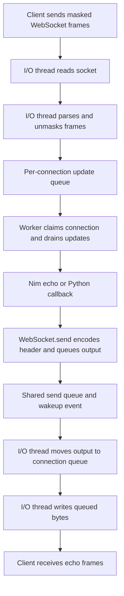

# PocketSocket Output Optimization: A Technical Study

**Date:** 2026-09-06  
**Scope:** The bundled Mummy server's outbound socket path  
**Status:** Implemented and benchmarked on Linux; Windows fallback type-checked

## Abstract

**Problem.** PocketSocket's native Nim echo handler had lower measured
throughput than aiohttp on a single-connection workload. Source inspection
identified a specific inefficiency: each writable event transmitted either
one frame header or part of one payload, even when more output was queued.

**Intervention.** The output path was changed to submit several existing memory
buffers in one Linux `sendmsg` operation, then continue writing within explicit
byte and syscall-attempt limits. Worker scheduling and Python callback handling
were not changed.

**Evaluation.** Five samples per payload and server mode were collected before
and after the intervention using release builds on the same two-CPU Linux host.
For pure-Nim echo, median throughput increased from 74,406 to 286,288 messages/sec
at 64 bytes and from 52,938 to 109,243 at 1 KiB. Correctness was examined with
byte-accounting tests, nonblocking socket tests, and HTTP/WebSocket integration
tests.

**Interpretation.** These observations support the hypothesis that output
granularity substantially limited small-message throughput on this workload.
They do not establish exact syscall savings, universal latency improvement,
or multicore scalability. The experiment combines two mechanisms, gathering
buffers and draining output, so their individual contributions remain unknown.

## Audience and Reading Guide

This document assumes familiarity with Python functions, lists, exceptions,
and basic algebra. It does not assume familiarity with Nim, C pointers, epoll,
or the WebSocket specification. Terms are defined below and then used in
worked examples.

Read the foundations before the implementation sections on a first pass.
Sections 1-4 establish the problem and experimental hypothesis; sections 5-10
explain the algorithm and its correctness conditions; sections 11-14 describe
evidence, limitations, and reproducibility. The glossary is a reference, not
a vocabulary test.

We distinguish four kinds of statement:

| Label | Meaning in this document | What it does not establish |
| --- | --- | --- |
| Code observation | A property visible in the inspected implementation. | How much execution time that property consumes. |
| Correctness argument | A deduction from stated assumptions and invariants. | A machine-checked proof that every implementation branch satisfies them. |
| Measurement | An outcome recorded by the benchmark or tests. | The same outcome on every host or workload. |
| Hypothesis | A proposed explanation or prediction requiring further evidence. | A confirmed cause merely because the explanation is plausible. |

## Foundations

### A. Glossary

#### Networking and Operating Systems

| Term | Meaning | Why it matters here |
| --- | --- | --- |
| Byte | Eight bits; represented by one element of Python `bytes`. | Socket operations count bytes, not characters or messages. |
| KiB | 1,024 bytes. A 16 KiB payload contains 16,384 bytes. | Distinguishes binary units from decimal kilobytes. |
| Protocol | Rules for interpreting exchanged bytes. | WebSocket headers tell the receiver how to parse the TCP stream. |
| TCP | A reliable, ordered byte-stream transport while a connection remains usable; it does not preserve application message boundaries. | Several sends may arrive in one receive, or one send in several receives. |
| Socket | An operating-system-managed endpoint for communication. | The writer asks the local socket to accept outgoing bytes. |
| File descriptor / socket handle | A process-local identifier for an OS resource; on Linux, sockets use integer file descriptors. | The selector and send functions identify a connection using this handle. |
| User space | Where ordinary application code executes, including Python and compiled Nim. | Application buffers start here. |
| Kernel | The privileged part of the OS that manages sockets, scheduling, and other resources. | Socket output crosses into kernel-managed code and buffers. |
| Syscall | A request from application code to the kernel, such as a socket send. | Repeating this request has overhead independent of payload size. |
| Nonblocking | An operation returns rather than waiting for unavailable socket capacity or input. | The caller must handle partial progress and temporary inability to proceed. |
| Readiness | A report that an operation may make progress without waiting for data or capacity. | It is not a guarantee that an entire frame will fit. |
| Selector | An interface that waits for readiness on a collection of handles. | The I/O loop uses it to decide which sockets to service. |
| epoll | Linux's readiness-notification facility, used by this Nim selector backend. | It reports writable sockets; it does not serialize WebSocket messages. |
| Write interest | A registration asking the selector to report writable readiness. | It remains enabled while application output is pending. |
| Drain | Repeatedly make progress on queued work until empty, blocked, or limited by a budget. | It does not necessarily mean emptying the whole queue in one invocation. |
| Backpressure | A downstream component cannot currently accept more data. | A full socket send buffer requires retaining unsent application output. |
| Short / partial write | The socket accepts fewer bytes than requested, returning a positive count. | The next attempt must start at the first unaccepted byte. |
| `EAGAIN` / `EWOULDBLOCK` | Error codes meaning the nonblocking operation cannot proceed now. | They normally require retrying later, not closing the connection. |
| `EINTR` | An interruption reported without a positive progress count. | The writer retries within a bounded number of attempts. |
| `SIGPIPE` / `MSG_NOSIGNAL` | A signal that can arise when writing to a closed stream, and the Linux send flag suppressing that signal for this call. | A failed send should not terminate the server process. |
| Loopback | Networking between endpoints on the same host. | It avoids an external network path but still involves the kernel and client CPU. |

#### WebSocket

| Term | Meaning | Why it matters here |
| --- | --- | --- |
| RFC 6455 | The specification defining the core WebSocket handshake and framing protocol. | The writer must preserve the bytes that implement those rules. |
| HTTP upgrade | The opening HTTP exchange establishing a WebSocket connection, normally completed with status `101`. | Its response must precede WebSocket frames on the stream. |
| Message | An application-level text or binary unit. | One message may occupy one frame or several fragments. |
| Frame | A protocol unit with a header and payload. | The benchmark uses one complete data frame per message. |
| Header | Bytes describing properties such as frame type and payload byte length. | These are stored separately from the payload in the output queue. |
| Payload | The bytes carried by a frame, excluding its header. | This is the echoed application data in the measured workload. |
| Opcode | A small integer identifying text, binary, continuation, close, ping, or pong frames. | The receiver needs the original opcode even when writes are combined. |
| FIN | A bit marking the final fragment of a message, or the end of an unfragmented message. | Combining writes must not change it. |
| Masking | XOR of client frame payload bytes with a repeating four-byte key. | Required for client-to-server frames; it is not encryption. |
| Control frame | A close, ping, or pong frame, with payload at most 125 bytes and no fragmentation. | Connection closing has semantics beyond ordinary payload delivery. |

#### Nim, C, and Concurrency

| Term | Meaning | Python-oriented interpretation |
| --- | --- | --- |
| Buffer | Memory holding bytes awaiting processing or output. | Similar in purpose to a `bytes` or `bytearray`, without implying identical ownership rules. |
| Pointer / address | A value identifying a memory location. | Unlike a Python reference, a raw pointer does not by itself keep an object alive. |
| Offset | An integer position relative to the start of a buffer. | Similar to the start index of a slice; `bytesSent` is an offset into header plus payload. |
| `iovec` / `IOVec` | A C structure containing a buffer address and byte length. | Roughly the description of a `memoryview` segment, not a copy of those bytes. |
| Vectored / scatter-gather I/O | One operation reading or writing multiple memory regions in order. | Submit a list of byte views without first joining them. This is not SIMD arithmetic. |
| `send` / `writev` / `sendmsg` | APIs for sending one region, writing a vector of regions, or sending a message descriptor with vectors and flags. | `sendmsg` still writes an ordinary byte stream when used on a TCP socket. |
| `Tmsghdr` | Nim's binding for C's `struct msghdr`, which describes a `sendmsg` request. | A record containing a pointer to the vector array and its element count, among other fields. |
| FFI / ABI | Foreign-function interface / binary calling convention and data-layout contract. | Rules that let Nim call C-compatible OS functions with the expected types. |
| `cint` / `csize_t` | Nim types matching C `int` / `size_t`. | Fixed native representations, unlike arbitrary-precision Python integers. |
| `ref object` | A Nim managed reference to a record. | Closer to an object reference than to a borrowed raw pointer. |
| ARC | Nim's automatic reference counting memory-management mode used by this build. | Managed references govern lifetime; borrowed C pointers do not add references. |
| Deque | A double-ended queue. | Comparable to `collections.deque`; this writer appends at the back and consumes at the front. |
| Thread | An execution context scheduled by the OS within a process. | Python threads are also threads; whether code holds the GIL is a separate issue. |
| I/O thread | The thread responsible here for socket reads, parsing, and socket writes. | Distinct from the workers that execute handlers. |
| Worker pool | A set of threads available to execute queued handler work. | More workers do not imply concurrent callbacks for one connection. |
| Lock / mutex | A synchronization primitive allowing one holder into a protected region at a time. | Like `threading.Lock`; it is not automatically the Python GIL. |
| Ownership / lifetime | Responsibility for keeping data valid and determining when it may be freed. | Essential when native code passes byte addresses to the OS. |
| GIL | CPython's global interpreter lock in the conventional build used here. | Python callbacks must use it correctly; native socket writes do not remove that requirement. |
| Invariant | A property required to hold before and after each algorithm step. | For example, accepted bytes plus pending bytes must equal the original stream. |

### B. From a Python send to Kernel Buffers

A typical Python program calls `socket.sendall(payload)`. That convenience API
attempts repeated sends until the complete payload is accepted or an error
occurs. Lower-level `socket.send(payload)` instead returns a byte count and
may accept only a prefix. PocketSocket's native writer has to implement that
progress accounting itself.

Consider four distinct stages:

```text
application output queue
    -> local kernel socket send buffer
    -> remote kernel socket receive buffer
    -> remote application parser
```

A positive send result tells us about the first transition only. It does not
prove that the remote application parsed or acted on the message. Even TCP
acknowledgement is not an application-level acknowledgement.

Both application and kernel buffers may coexist. Removing accepted bytes
from the application queue does not mean those bytes have already left the
host; it means the ordinary send operation no longer needs that application
storage to complete its accepted portion.

The OS can report a socket writable and then accept only part of the next
request. The report concerns current capacity, not WebSocket frame lengths.
Correct code therefore uses the return value, not the readiness report, as
the evidence for how many bytes progressed.

### C. The Required Part of RFC 6455

The relevant specification is [RFC 6455](https://www.rfc-editor.org/rfc/rfc6455.html):
section 4 covers the opening handshake, section 5 covers framing, and sections
5.5 and 7 describe control frames and closing. This study explains only what
is needed to understand the output change; it is not a complete protocol
implementation guide or a conformance claim.

After the opening HTTP upgrade, bytes on the connection are parsed as
WebSocket frames. For a final, uncompressed text frame sent by the server:

```text
first byte:  FIN | RSV1 RSV2 RSV3 | opcode
second byte: MASK | seven-bit payload-length field
then:        extended payload length, if required
then:        payload bytes
```

FIN occupies the highest bit of the first byte. The reserved bits are zero
when no extension using them is negotiated. Text uses opcode `1`, binary uses
`2`, continuation uses `0`, close uses `8`, ping uses `9`, and pong uses `10`.
The MASK bit is zero for server-to-client frames. A compliant server must not
mask frames it sends to clients.

Payload length is measured in **bytes**, not Unicode characters:

| Payload byte length | Seven-bit length field | Additional length bytes | Unmasked header size |
| --- | --- | --- | --- |
| 0 through 125 | The length itself | None | 2 bytes |
| 126 through 65,535 | `126` | Two-byte unsigned length | 4 bytes |
| 65,536 and above | `127` | Eight-byte length, with its highest bit zero | 10 bytes |

Extended lengths use network byte order: the most significant byte is sent
first. The protocol's representable length is not the server's allowed message
size; PocketSocket separately enforces configured limits.

For example, a server echoing the text `hi` sends:

```text
hexadecimal: 81 02 68 69
             |  |  +----- UTF-8 payload b"hi"
             |  +-------- MASK=0, payload length=2
             +----------- FIN=1, reserved bits=0, opcode=1
```

In Python, this byte sequence is `b"\x81\x02hi"`. The writer stores the first
two bytes as the header and the final two as the payload. Sending all four
bytes at once or sending them in several pieces produces the same WebSocket
frame, provided their order and values are unchanged.

Client-to-server frames have MASK set and carry a four-byte masking key after
the length fields. For payload byte index $j$ and key $k$, masking is:

$$
	ext{masked}[j] = \text{payload}[j] \mathbin{\mathrm{XOR}} k[j \bmod 4]
$$

Applying the same XOR again recovers the payload. The key travels with the
frame, so this does not provide secrecy. RFC 6455 requires a fresh,
unpredictable masking key for each client frame. The benchmark prebuilds and
reuses frames on loopback to keep client masking work outside the timed loop;
that is a benchmark simplification, not guidance for a production client.

The `hi` server frame's two-byte header becomes a six-byte header for a masked
client frame: two base bytes plus four key bytes. Likewise, the measured
64B, 1 KiB, and 16 KiB payloads have unmasked server headers of 2, 4, and 4
bytes respectively.

Finally, distinguish three boundaries:

| Boundary | Defined by | Does this patch change it? |
| --- | --- | --- |
| Application message | The sending application's message and protocol fragmentation rules. | No. |
| WebSocket frame | FIN, opcode, length, masking, and payload encoding. | No. |
| Socket write operation | How many existing byte regions the server submits to the OS at once. | Yes. |

A message may be fragmented across several frames. A control frame may occur
between fragments, and text must satisfy UTF-8 requirements at the message
level. The throughput benchmark exercises the simpler case: each text message
is one final frame. This optimization does not add fragmentation support,
change validation rules, or combine several messages into a new message.

### D. Reading the Nim and C Expressions

These are translations of notation, not claims that Python and Nim have
identical memory behavior:

| Nim expression | Meaning | Approximate Python concept |
| --- | --- | --- |
| `proc name(...): int =` | Define a function returning an integer. | `def name(...) -> int:` |
| `let offset = ...` | Bind a local that cannot be reassigned. | A local assignment used immutably by convention. |
| `var remaining = ...` | Bind a mutable local. | A local that is updated in a loop. |
| `result = value` | Assign the function's implicit return variable. | Preparing the value returned by the function. |
| `object` / `field: type` | Define a record and typed fields. | A dataclass-like record. |
| `array[16, IOVec]` | Fixed-length storage for sixteen descriptors. | A fixed-size list conceptually, but with native contiguous layout. |
| `buffer[offset].addr` | Address of the byte at the given index. | A borrowed view beginning at an offset, not an integer byte value. |
| `length.csize_t` | Convert a value to C's size type. | An FFI type conversion, not access to an integer attribute. |
| `message.addr` | Address of the native descriptor record. | Passing a structure by pointer to a native function. |
| `when defined(linux)` | Choose code at compile time for that target. | Build-time selection, not a runtime `if` on every send. |
| `entry.consumeWritten(count)` | Nim's method-call syntax for a procedure. | Here it means `consumeWritten(entry, count)`. |
| `0 ..< limit` | Integer range excluding the upper endpoint. | `range(limit)`. |

In particular, a Nim `string` here is byte storage used by native code. Do not
read it as a Python Unicode `str` whose length counts characters. Encoding text
for a WebSocket payload and deciding how to write its already-encoded bytes
are different responsibilities.

A descriptor containing `buffer[offset].addr` does not copy the buffer. This
is why the later ownership discussion is a correctness requirement, not just
a memory optimization detail.

## Contents

Foundations: [glossary](#a-glossary), [socket operations](#b-from-a-python-send-to-kernel-buffers),
[WebSocket framing](#c-the-required-part-of-rfc-6455), and [Nim/C notation](#d-reading-the-nim-and-c-expressions).

1. [Problem and measurement definitions](#1-problem-and-measurement-definitions)
2. [Architecture and queue ownership](#2-architecture-and-queue-ownership)
3. [Baseline algorithm](#3-baseline-algorithm)
4. [Hypothesis and experimental design](#4-hypothesis-and-experimental-design)
5. [Vectored output and protocol preservation](#5-vectored-output-and-protocol-preservation)
6. [Implementation decomposition](#6-implementation-decomposition)
7. [Partial writes and correctness argument](#7-partial-writes-and-correctness-argument)
8. [Backpressure and error handling](#8-backpressure-and-error-handling)
9. [Fairness and readiness notifications](#9-fairness-and-readiness-notifications)
10. [Close frames, HTTP, and memory lifetime](#10-close-frames-http-and-memory-lifetime)
11. [Results and interpretation](#11-results-and-interpretation)
12. [Validation evidence and gaps](#12-validation-evidence-and-gaps)
13. [Scope exclusions](#13-scope-exclusions)
14. [Reproduction and further experiments](#14-reproduction-and-further-experiments)
15. [Conclusions and review questions](#15-conclusions-and-review-questions)

## 1. Problem and Measurement Definitions

The starting point was the [August comparison](../results/benchmarks/2026-08-14/2026-08-14-compare.txt).
It compared minimal echo handlers driven by the same raw-socket client. Startup
and connection establishment looked good; steady-state throughput did not.

There are two PocketSocket modes that matter here:

| Mode | What happens for each application message |
| --- | --- |
| `ps-nim-echo` | A Nim handler queues the payload back to its sender; no Python callback is registered. |
| `ps-hook-echo` | A Nim worker calls Python; the callback calls `ps.send()` to queue the reply. |

The distinction is important. If the no-Python path is slow, optimizing Python
argument conversion cannot be the whole answer. Conversely, improving the
shared writer should help both paths, without necessarily helping them equally.

We did not use the August numbers as the before side of this change. We built
the unchanged native extension again and collected a fresh baseline on the
same host used for the after run.

### Throughput and Latency Measure Different Properties

Define throughput for a completed sample as $R = N/T$, where $N$ is the number
of echoed messages and $T$ is elapsed wall-clock time in seconds. Its unit is
messages per second. Wall-clock time includes waiting and scheduling, not just
CPU instructions executed by the server.

Define round-trip latency for message $j$ as $L_j = t_{\mathrm{reply},j} -
t_{\mathrm{send},j}$. It includes the client, kernel, server, and return path.
The p50 is the median of the latency distribution; p99 is the 99th percentile,
a measure of its slower tail. A microsecond is $10^{-6}$ seconds.

For strictly sequential requests, throughput is related to the mean latency,
not generally to p50. For batched requests, several messages are outstanding
at once, so taking the reciprocal of the median latency does not predict
batched throughput.

The throughput workload sends a batch of 256 prebuilt frames, receives 256
echoes, and repeats. Frames are constructed outside the timed loop, so Python's
client-side masking work is not included in the measured interval.

The client waits for the echoes. This is not a measurement of how quickly it
can fill its own kernel send buffer. It still measures an entire loopback
client/server exchange, not isolated server CPU execution.

The latency workload is different: send one frame, wait for its echo, repeat.
It has only one message in flight. A change can improve batched throughput a
great deal while improving one-at-a-time latency only modestly.

Also, neither workload answers how the server scales across many connections
or cores. One busy WebSocket is a useful experiment, not a complete capacity
model for the application.

## 2. Architecture and Queue Ownership

The public API is not where socket bytes are written. That work belongs to
the bundled [Mummy implementation](../server/src/mummy.nim).

Here is the path in broad terms:



The following queues have distinct roles and synchronization requirements.

**The inbound WebSocket update queue** contains events waiting for a handler.
Workers coordinate through `websocketQueuesLock` and `websocketClaimed`. A
worker claims a connection and processes its queued updates serially. Different
connections can be handled by different workers; one connection's callbacks
are not spread across multiple workers at the same time.

**The shared send queue** carries output submitted by handlers to the I/O
thread. `WebSocket.send()` takes `sendQueueLock`, appends an `OutgoingBuffer`,
and triggers the send event when the shared queue transitions from empty to
nonempty. It does not synchronously transmit the message to the client.

**The per-connection output queue** belongs to the I/O thread. Once shared
output has been routed to its connection, `dataEntry.outgoingBuffers` holds
the buffers that the socket writer will consume.

That last queue is the focus of this change.

The separation can be restated as an ownership table:

| State | Who produces it? | Who consumes it? | Coordination |
| --- | --- | --- | --- |
| Inbound update queue | I/O thread parsing client frames. | A worker running callbacks. | Queue lock plus per-connection claim state. |
| Shared send queue | Workers or callers submitting replies. | I/O thread routing replies to sockets. | Send-queue lock and wakeup event. |
| Connection output queue | I/O thread after routing shared output. | The same I/O thread's writer. | Single-thread ownership of this queue. |

A lock protects shared memory; a wakeup event informs a waiting thread that
work exists. They solve different problems. Releasing a lock alone does not
necessarily wake a thread sleeping in a selector.

### Where epoll fits

On Linux, Nim's selector backend uses epoll to report readiness. In this
server, one I/O loop owns the selector and the socket I/O. Worker threads
communicate with it through queues and wakeup events.

This is not a design where all workers call `epoll_wait` on a shared epoll
instance and compete to handle the same socket. There is shared state and
synchronization, but "shared epoll contention" is not a precise description
of the code we changed.

Nor does being outside the GIL mean every native operation runs in parallel.
Parsing and socket I/O still run on this one I/O thread. Worker execution can
overlap with that thread, but adding workers does not create additional I/O
loops.

The [GIL investigation](bug/GIL_THREADING_FIX.md) explains why Python callbacks
must acquire the GIL and why the blocking server call must release it. Those
correctness rules remain intact. This optimization does not change Python
thread attachment, callback lifetime, or lock ordering.

## 3. Baseline Algorithm

An `OutgoingBuffer` contains two strings and an offset:

```nim
buffer1, buffer2: string
bytesSent: int
```

For a normal WebSocket data frame, `buffer1` is the encoded frame header and
`buffer2` is the payload. Keeping them separate is reasonable: there is no
need to copy a large payload just to prepend a few header bytes.

The old writable-event branch was effectively this pseudocode:

```text
take the first queued output buffer
if its header is not finished:
    send the remaining header
else:
    send the remaining payload
record progress
return to the event loop
```

A later `afterSend` pass removed the buffer if it was complete and disabled
write interest if the queue had become empty.

For an ordinary nonempty echo, even if the socket accepted every requested
byte, the sequence was:

```text
writable event: send header A
writable event: send payload A
writable event: send header B
writable event: send payload B
...
```

The header and payload of a single frame required at least two send calls and
separate selector-loop iterations. Partial writes could require more.

Those iterations do not necessarily involve sleeping. A still-writable socket
can make the selector return immediately. They also do not necessarily imply
an OS thread context switch. But there is still repeated readiness processing,
queue inspection, branching, and entry into the kernel.

Likewise, two send calls do not guarantee two TCP packets. TCP and the kernel
decide segmentation; the API calls do not define packet boundaries. The
problem we can establish from the code is small units of application work per
send call and per writable event, not an exact packet-count claim.

For 256 already-queued, nonempty frames, the old writer needed at least 512
send calls. This is a lower bound derived from its control flow: two nonempty
regions per frame, each requiring a separate call. It is not a measured count.

Nim can compile that control flow efficiently. It cannot automatically merge
observable socket operations or invent a different event-loop policy.

## 4. Hypothesis and Experimental Design

The local hypothesis was:

> Small output operations and repeated trips through the selector loop are
> materially limiting echo throughput. Gathering existing buffers and draining
> more output per writable event should improve throughput without changing
> worker scheduling or the public API.

### Experimental Questions

| Question | Evidence required | Evidence in this study |
| --- | --- | --- |
| Does the old writer separate header and payload operations? | Inspection of the writable-event branch. | Yes: source-level observation. |
| Does the new algorithm preserve the byte sequence? | An invariant argument and tests at partial-write boundaries. | Argument below plus focused and integration tests; not formal verification. |
| Does the intervention improve throughput? | Comparable before/after measurements. | Five samples per condition, with an aiohttp control. |
| How many syscalls or context switches does it save in practice? | Runtime tracing or counters. | Not measured. |
| Does it improve latency under competing clients? | Mixed-load latency/fairness measurements. | Not measured; correctness with concurrent clients is a different test. |

The independent variable is the writer implementation. Outcomes include sample
throughput and round-trip latency percentiles. Build mode, worker configuration,
client code, payload sizes, and message counts are held constant between the
two PocketSocket phases. Host scheduling and competing load are not perfectly
controlled; they are potential confounders.

The comparison is an engineering before/after study, not a randomized trial.
We did not pre-register a minimum effect size or perform a significance test.
The later results therefore report observed changes, rather than claiming
statistical certainty from five samples.

That hypothesis makes useful predictions. Small messages should benefit most
from reducing fixed per-message overhead. Both echo modes should benefit
because both use the same writer. Large messages may benefit less if their
cost is increasingly elsewhere.

It is also falsifiable. If the same release workload showed little or no
improvement after this change, we would need to reconsider whether output
granularity was important on that host.

We changed the writer, then reran the same benchmark. We did not change the
worker count, optimize the parser, replace the allocator, bypass the callback
API, or move handlers onto the I/O thread.

One qualification matters: this experiment combines **vectored writes** and
**bounded draining**. It shows the effect of that combined writer change. It
does not isolate how much of the gain belongs to each mechanism. A three-way
comparison with scalar draining as the middle implementation would be needed
to separate those contributions.

## 5. Vectored Output and Protocol Preservation

Normally, `send()` takes one address and a length. Vectored I/O takes a list
of addresses and lengths. On Linux, an element of that list is an `iovec`:

```text
address of bytes | number of bytes
```

For two queued WebSocket frames, we can describe:

```text
vector 0: header A
vector 1: payload A
vector 2: header B
vector 3: payload B
```

The kernel consumes the vectors in order as one logical sequence of bytes.
The payload strings can stay where they already are.

### Why sendmsg rather than writev?

Both can express scatter/gather output. The implementation uses `sendmsg`
because its flags parameter lets Linux receive `MSG_NOSIGNAL` on the same
operation. A disconnected peer must become a socket error, not a `SIGPIPE`
that can terminate the whole server process.

The core call is:

```nim
var message: Tmsghdr
message.msg_iov = vectors[0].addr
message.msg_iovlen = vectorCount.csize_t
result = clientSocket.sendmsg(message.addr, MSG_NOSIGNAL)
```

This uses Nim's existing POSIX declarations. No new native dependency or
custom C ABI declaration was necessary.

Read the four statements in order:

1. `var message: Tmsghdr` creates a descriptor with default-initialized fields. For the existing connected socket, no new destination address or ancillary data is supplied.
2. `msg_iov` points at the first element of the local `vectors` array. The kernel uses the accompanying count to determine how many descriptors to examine.
3. `msg_iovlen` is the number of descriptors, **not** the number of payload bytes. Its conversion matches the Linux binding's native field type.
4. `sendmsg` receives the socket handle, descriptor address, and flags, then returns an accepted byte count or a negative error result.

Each vector's `iov_len` is a byte length. The vectors may describe separate
allocations; their addresses need not be adjacent. What must be adjacent is
their intended order in the outgoing stream.

Python on supported Unix systems exposes a related `socket.sendmsg` API.
Conceptually, the input resembles a list of `memoryview` segments. The Nim
implementation constructs the native address/length descriptors directly.

### This is not zero-copy networking

The optimization avoids constructing a new contiguous application string
containing every header and payload. It does not request kernel zero-copy
transmission. Ordinary `sendmsg` still generally copies data into kernel
socket buffers.

The useful claim is "fewer calls and no extra application-level concatenation
buffer," not "no copies."

### TCP bytes are not WebSocket messages

TCP exposes an ordered byte stream. WebSocket frame boundaries are described
by the frame headers carried in that stream, not by the number of send calls.

Writing three encoded frames together does not turn them into one WebSocket
frame. Writing a header in two pieces does not turn it into two frames either.
The receiver parses the same sequence of headers and lengths.

This gives us freedom to change write granularity while preserving the
application-visible protocol exactly.

### The batching is opportunistic

The server does not wait for eight frames to arrive before sending. It gathers
whatever is already in the connection's output queue when the socket gets its
turn. A single queued message can have its header and body sent together.

There is no batching timer or minimum batch size introducing an intentional
wait. A queue filled by the worker during an earlier part of the loop simply
offers more work to combine.

## 6. Implementation Decomposition

The new code separates three concerns that used to be spread between the
writable branch and `afterSend`.

| Function | Inputs | Observable result | State it may change |
| --- | --- | --- | --- |
| `writePending` | Socket, connection output queue, remaining byte budget. | Accepted byte count or negative error result. | Kernel socket state; not application queue offsets. |
| `consumeWritten` | Connection queue and accepted byte count. | Whether a connection-closing entry has completed. | Queue front, offsets, and close-frame completion flag. |
| `drainWrites` | Socket and connection state. | Whether the caller should close the connection. | Coordinates both operations and updates local budget counters. |

This separation lets tests examine the bookkeeping independently of the
kernel's choice of how many bytes to accept.

### writePending: describe and attempt the next bytes

`writePending` builds a bounded list of vectors from the current queue. It
starts from each buffer's existing `bytesSent` offset and includes only bytes
that have not already been accepted by the socket.

The starting offsets are:

```nim
let headerOffset = min(outgoingBuffer.bytesSent, outgoingBuffer.buffer1.len)
let bodyOffset = max(0, outgoingBuffer.bytesSent - outgoingBuffer.buffer1.len)
```

If we are partway through the header, the header vector begins there and the
body vector begins at zero. If the header is finished, it contributes no
vector, and the body begins at its remaining offset.

For a four-byte header and six-byte payload, the formulas give:

| `bytesSent` | `headerOffset` | `bodyOffset` | Remaining byte regions |
| ---: | ---: | ---: | --- |
| 0 | 0 | 0 | All 4 header bytes, then all 6 payload bytes. |
| 2 | 2 | 0 | Last 2 header bytes, then all 6 payload bytes. |
| 4 | 4 | 0 | No header; all 6 payload bytes. |
| 7 | 4 | 3 | No header; last 3 payload bytes. |
| 10 | 4 | 6 | Nothing; this entry can be retired. |

Here `min` prevents an offset beyond the end of the header, and `max` prevents
a negative payload offset while progress is still inside the header.

Each vector is also clipped to the remaining byte budget. Collection stops
when it reaches the vector limit, exhausts that budget, or includes output
marked `closeConnection`.

This function returns the syscall result. It does **not** pop the queue or
advance `bytesSent`. Describing data we would like to write is not evidence
that the socket accepted it.

### consumeWritten: account for confirmed progress

`consumeWritten` takes the positive byte count returned by the socket and
walks the queue from the front.

For each output buffer, its remaining length is:

$$
\text{pending} = \lvert\text{header}\rvert + \lvert\text{payload}\rvert - \text{bytesSent}
$$

If the accepted byte count covers the entire remaining buffer, the function
removes that buffer and continues with the next. Otherwise it increments the
front buffer's offset and stops.

Notice the unit: a byte count, not a frame count. A successful `sendmsg` can
finish several frames and stop midway through another one.

The initial `consumeWritten(0)` call in `drainWrites` also removes zero-length
completed entries at the front. This prevents the next send attempt from
trying to transmit an already-complete buffer. A WebSocket with an empty
payload is not a zero-byte output: it still has a header to send.

### drainWrites: decide how long this socket gets to work

`drainWrites` coordinates the two functions, handles errors, and enforces the
per-event limits. Its essential control flow is:

```text
retire any already-complete front entries
repeat while call budget remains:
    stop if queue is empty or byte budget is exhausted
    attempt a bounded write
    handle retryable or terminal errors
    subtract the accepted bytes from the budget
    consume exactly those bytes from the queue
    stop if a connection-closing output completed
```

Its Boolean result means **close this connection**, not "all output was sent."
A `false` result may mean the queue drained, the socket became backpressured,
or the fairness budget ran out. The caller distinguishes those cases where
needed by inspecting whether the output queue is empty.

The event loop now calls this function directly. The old `sentTo` list and
separate `afterSend` pass are no longer needed, because output accounting
happens after each successful write, before constructing the next vectors.

## 7. Partial Writes and Correctness Argument

### Worked Trace

Imagine two outputs queued like this. The strings are illustrative bytes,
not actual encoded WebSocket headers:

```text
A: header "HEAD"  payload "body"    total 8 bytes
B: header "NEXT"  payload "data"    total 8 bytes
```

Suppose the first syscall accepts only two bytes. It accepted `HE`, not the
whole header. The queue still contains both outputs:

```text
A.bytesSent = 2
next vectors: "AD", "body", "NEXT", "data"
```

The next syscall accepts three bytes: `ADb`. A's header is now complete and
one payload byte has been accepted:

```text
A.bytesSent = 5
next vectors: "ody", "NEXT", "data"
```

The next syscall accepts five bytes: `odyNE`. Accounting consumes A's final
three bytes, removes A, and applies the remaining two bytes to B:

```text
A removed
B.bytesSent = 2
next vectors: "XT", "data"
```

A final six-byte write empties the queue. The receiver sees exactly:

```text
HEADbodyNEXTdata
```

Nothing is resent. Nothing is skipped. No assumption was made that the kernel
stopped on a header, payload, or frame boundary.

This is the central correctness obligation of the optimization. Sending more
buffers at once is easy; mapping an arbitrary accepted prefix back onto the
original queue is what makes it safe.

One invariant helps reason about it: after accounting, the front buffer is
the first unfinished output, and every later buffer is still untouched. The
writer must never advance an offset based on the requested length instead of
the returned length.

### Model and Assumptions

The following is a correctness argument for the algorithm, not a formal
verification of the compiled program. Its purpose is to make the obligations
explicit enough to inspect and test.

Let an output entry be $F_i = H_i \Vert P_i$, where $H_i$ is its header,
$P_i$ its payload, and $\Vert$ denotes byte concatenation. Define its byte
length as $\ell_i = |F_i|$, and let $o_i$ be its accepted offset. A slice
$F_i[o_i:]$ means the bytes from offset $o_i$ to the end, as in Python slicing.

The argument assumes:

1. Each entry contains valid, stable byte storage and $0 \leq o_i \leq \ell_i$.
2. Queue order is the required stream order. For the current pending sequence, only the front unfinished entry may have a nonzero offset.
3. The I/O thread is the only writer to this socket stream and the only mutator of this connection's output queue during a send/accounting operation.
4. A positive syscall return $n$ means exactly the first $n$ requested bytes were accepted, with $n$ no larger than the request. A retryable negative result does not report accepted bytes.
5. The vector builder stops at a connection-closing entry; no later entry is part of the permitted stream.

These assumptions are necessary. For example, a second independent writer
could insert bytes between our operations, and premature destruction of a
payload could invalidate a vector's address. Correct offsets alone cannot
protect against either violation.

### Conservation of the Byte Sequence

For a finite sequence of queued output through the first closing boundary,
let $S$ be the complete intended byte sequence, $A$ the prefix already accepted
by the socket, and $U$ the pending suffix represented by the queue. The central
invariant is:

$$
S = A \Vert U
$$

Initially $A$ is empty and $U=S$, so the invariant holds. Suppose it holds
before a write. The vector builder constructs a prefix $V=U[:q]$, where $q$
is limited by the byte budget, vector limit, and closing boundary.

If the socket accepts $n$ bytes, with $0<n\leq q$, then the required update is:

$$
A' = A \Vert U[:n], \qquad U' = U[n:]
$$

Therefore:

$$
A' \Vert U' = A \Vert U[:n] \Vert U[n:] = A \Vert U = S
$$

This proves byte preservation for the abstract step: the output prefix grows
by exactly what was accepted, and the queue loses exactly the same prefix.
Appending newly queued output extends the pending suffix without changing
already-accepted bytes, provided no closing boundary forbids that output.

### Why the Queue Update Implements That Step

Let $r=\ell_0-o_0$ be the remaining length of the front entry.

- If $n<r$, increment its offset by $n$. No later entry is touched. The remaining representation is precisely $U[n:]$.
- If $n\geq r$, remove the front entry and subtract $r$ from the count still to account for. Apply the same rule to the new front entry.
- If the count becomes zero, no unfinished bytes advance. Any already-complete zero-length front entries can be removed without changing the byte sequence.

Each removal eliminates a queue entry; each partial update consumes the rest
of the count and stops. For a finite queue this bookkeeping terminates. By
induction over successful writes, the accepted sequence is always an ordered
prefix of the intended output: bytes are neither duplicated nor omitted.

On a retryable error, $A$ and $U$ remain unchanged, so the invariant still
holds. On a terminal connection error, we do **not** claim eventual delivery
of the remainder. The writer can preserve an accepted prefix and still be
unable to complete transmission.

### Safety, Progress, and Fairness Are Separate Claims

| Property | Meaning | What supports it here |
| --- | --- | --- |
| Safety | No unintended byte duplication, omission, reordering, or output after a close boundary. | The prefix argument, ownership conditions, and boundary tests. |
| Conditional progress | Pending bytes can eventually advance if the peer accepts data and the loop continues servicing the socket. | Retryable-error handling plus retained write interest in the level-triggered loop. |
| Bounded write effort | One invocation performs at most the configured syscall attempts and accepted bytes. | Loop bounds and request clipping. |
| Fair service | Other connections receive acceptable service under load. | A design intention, not established by the bounds or current throughput measurements alone. |

A useful counterexample is a peer that never reads. Correct code may remain
backpressured forever. That does not violate byte safety, but it shows why
eventual completion cannot be proved without an assumption about the peer.

## 8. Backpressure and Error Handling

A nonblocking socket does not promise to accept everything we hand it. Its
send buffer has finite capacity. The receiving application may be slow, the
network may be congested, or there may simply be more output than currently
fits.

That situation is normal. Correct output code needs more than a
"positive means success, everything else means close" branch.

| Result | Meaning for this writer | Action |
| --- | --- | --- |
| Positive byte count | This prefix was accepted by the local socket. | Account for exactly that prefix; continue within the budget. |
| `EAGAIN` or `EWOULDBLOCK` | No more output can be accepted now. | Keep queued bytes and write interest; return to the event loop. |
| `EINTR` | This call was interrupted without reporting accepted bytes. | Retry within the syscall-attempt budget. |
| Other negative result | A terminal error for this writer. | Request connection cleanup. |
| Zero for a nonempty request | No progress was made. | Request cleanup rather than spin indefinitely. |

Windows uses the corresponding Winsock error codes for interruption and
would-block handling.

At the C-compatible interface, failure is usually represented by `-1`, with
the reason retrieved separately. On POSIX, `errno` is per-thread error state;
Nim reads it through `osLastError`. The Windows branch uses
`wsaGetLastError`. The reason must be captured before unrelated operations
could overwrite it. The new code reads it immediately after the failed send.

Python normally turns this convention into exceptions: for example,
`BlockingIOError` for a would-block condition. Native code exposes the count
and error-code branches more directly. A partial **positive** result is not
an exception or failure: it is confirmed progress that must be accounted for.

The old writable branch treated all nonpositive results as connection failure.
The new code explicitly distinguishes temporary backpressure. A loop that
continues writing is much more likely to encounter `EAGAIN`, so this is not an
optional refinement added after the optimization. It is part of making
draining correct.

An `EINTR` retry does not consume bytes, but it does consume one attempt from
the call budget. Repeated interruptions therefore cannot keep this function
running forever.

There is another distinction worth keeping: "accepted by the socket" does
not mean "received and processed by the remote application." A successful
send permits us to release or reuse our ordinary application buffer; it is
not an application-level acknowledgement. The echo benchmark waits for the
reply on the client precisely because a send completion alone is insufficient.

## 9. Fairness and Readiness Notifications

Once writing more in one turn helps, why not drain an arbitrarily large queue
before doing anything else?

Because the I/O thread has other jobs. It must read incoming traffic, accept
connections, process wakeups and shutdown, and write to other clients. One
productive socket can monopolize that thread just as effectively as one slow
operation can.

The implementation uses three limits:

```nim
maxWriteBytesPerEvent = 256 * 1024
maxWriteCallsPerEvent = 16
maxWriteVectors = 16
```

**The byte budget** caps accepted output per socket turn, including headers.
Without it, large payloads could make one visit move an excessive amount of
data.

**The call budget** caps syscall attempts. Without it, a stream of tiny partial
writes or repeated interruptions could consume lots of time while remaining
under the byte limit.

**The vector limit** bounds the temporary descriptor array and how much queue
inspection one write attempt performs. Sixteen is a deliberately small bound,
not a claim that sixteen is the kernel's maximum or the optimal tuning value.

For ordinary frames with a nonempty header and payload, sixteen vectors can
describe eight complete frames. With all output available and every syscall
accepting its full request, sixteen calls can send 128 such frames per turn,
unless the byte limit stops it sooner.

Under those ideal conditions, 256 small queued frames could need 32 send calls
instead of at least 512, and about two writable turns instead of at least 512.
That is an explanatory upper-bound example, **not a traced syscall count from
the benchmark**. Real queue occupancy, short writes, and worker timing change
the actual ratio.

### Why pending output is not stranded

The loop uses read-and-write interest while output remains. If draining empties
the queue, it changes interest back to read-only. If it stops at a budget or
would-block result, write interest stays enabled.

This relies on the current level-triggered readiness model: a socket that
remains writable can be reported again even if we voluntarily stopped before
`EAGAIN`.

That detail is easy to miss in a future refactor. With edge-triggered epoll,
stopping early while the socket is still writable does not necessarily produce
another edge. An edge-triggered version would need an explicit continuation
mechanism or a different draining policy. Do not copy these budgets into an
edge-triggered loop without also designing how unfinished work gets scheduled.

The budgets are a scheduling safeguard, not a proof of equitable service.
They do not bound queue memory, impose a wall-clock deadline, or guarantee
latency for a quiet connection sharing the loop with many busy ones. That
requires a mixed-load fairness test.

### Readiness Modes, Defined Explicitly

In a **level-triggered** registration, readiness remains reportable while the
condition remains true. After a budget-limited return, a still-writable socket
can be reported on the next selector call. After `EAGAIN`, it can be reported
again when capacity becomes available.

An **edge-triggered** registration reports transitions rather than repeatedly
reporting the same persistent condition. A writer that voluntarily stops with
unused capacity may have pending data but no new transition to wake it.
That is why an edge-triggered design commonly drains to `EAGAIN` or explicitly
reschedules unfinished output itself.

Retaining write interest while a queue is empty has the opposite problem: a
writable socket can keep being reported even though there is nothing to send.
That can produce a busy loop. Disabling write interest when empty and retaining
it when work remains are both part of the scheduling policy.

## 10. Close Frames, HTTP, and Memory Lifetime

### Closing is a byte-stream boundary

Some output entries have `closeConnection` set. The new vector collector must
not send bytes from entries after one of those outputs, even if they happen
to be present in the queue.

Consider this deliberately defensive test arrangement:

```text
"before" -> "close" [closeConnection] -> "never"
```

The kernel must see `beforeclose`, not `beforeclosenever`. Vector collection
includes the closing entry but stops before its successor. Accounting requests
cleanup only once the closing entry's remaining bytes have been accepted.

`isCloseFrame` and `closeConnection` are different flags. `isCloseFrame`
classifies an output entry as a WebSocket close frame. Once all its bytes are
accepted, the writer sets the connection's `closeFrameSent` completion flag.
`closeConnection` separately tells the writer whether completion should request
transport cleanup.

RFC 6455 distinguishes the close control frame from the underlying TCP close.
An endpoint initiating a WebSocket close normally sends the control frame and
waits for the peer's close response. A closing endpoint must not send more
application data frames after its close frame. Existing queue admission and
connection state participate in enforcing that rule; the new writer alone
does not implement the entire closing handshake.

The optimization preserves those responsibilities. In particular, completion
of a locally initiated close frame is not automatically treated as permission
to destroy the TCP connection immediately.

### HTTP uses the same writer

Despite the WebSocket motivation, this is not an echo-only fast path. HTTP
responses also use the output queue. The HTTP upgrade response must precede
any WebSocket bytes. A response marked to close the connection must finish
before cleanup is requested.

The existing routing, upgrade waiting list, and queue order are unchanged.
Gathering may place an HTTP upgrade and subsequent bytes in the same kernel
write, but it cannot reverse their order. The client must already be able to
handle bytes arriving together because TCP never promised separate reads.

That shared behavior is why validation includes HTTP keep-alive and
connection-close responses, not just echo frames.

### Pointer lifetime is part of the design

An `IOVec` does not own the bytes at `iov_base`. It merely borrows their address.
That creates an obligation: the corresponding Nim strings must remain alive
and stable until `sendmsg` returns.

The per-connection output queue holds the `OutgoingBuffer` references while
vectors are built and submitted. Queue entries are only consumed afterward,
using the returned byte count. Workers append to the separate shared send
queue; they do not mutate the I/O thread's per-connection queue while its
vectors are in use.

Nonblocking here does not mean that `sendmsg` retains these pointers for an
asynchronous callback. It returns synchronously with a count or error. This
is ordinary socket output, not a zero-copy completion API with additional
buffer-lifetime requirements.

The approach therefore fits the existing ownership model without adding
another lock around the syscall.

The safe lifetime order is:

```text
queue retains the output objects and their strings
    -> build borrowed address/length descriptors
    -> call sendmsg while those addresses are valid
    -> sendmsg returns
    -> account for accepted bytes
    -> release completed entries; retain unfinished entries
```

Changing this to pop entries before `sendmsg` returns could release their
storage while native code still needs its address. Resizing a referenced
string could similarly move its storage. In Python, a retained object or
buffer view often manages lifetime for you; the C descriptor has no such
automatic relationship with the Nim object it points into.

## 11. Results and Interpretation

The [focused runner](../utils/benchmarks/bench_write_path.py) reused the existing
server definitions and workload functions. The experiment used:

- Linux on the same two-CPU host for both phases.
- Python 3.12.1 and Nim 2.2.10, with a release extension, ARC, and existing build settings.
- The default worker-count configuration in both phases.
- Five samples per target and payload, rotating target order between repetitions.
- A fresh server for each repetition/target/payload combination, running throughput then latency on separate connections.
- 100,000 messages per throughput sample at 64B and 1 KiB; 12,000 at 16 KiB.
- 2,000 measured round trips per latency sample, and 200 warmups per workload.
- aiohttp rerun as a control in both phases.

The table uses medians of the five throughput rates:

For sample rates $R_1,\ldots,R_5$, the reported value is
$\widetilde{R}=\operatorname{median}(R_1,\ldots,R_5)$. The reported ratio is
$S=\widetilde{R}_{\mathrm{after}}/\widetilde{R}_{\mathrm{before}}$, not the
median of paired sample ratios. The samples were not paired executions under
identical scheduling conditions. A ratio of 3.85 means throughput is 385% of
baseline, equivalently an increase of about 285%, not an increase of 385%.

| Path | Payload | Before msg/s | After msg/s | Ratio |
| --- | --- | ---: | ---: | ---: |
| Pure Nim | 64B | 74,406 | 286,288 | 3.85x |
| Pure Nim | 1 KiB | 52,938 | 109,243 | 2.06x |
| Pure Nim | 16 KiB | 19,912 | 22,616 | 1.14x |
| Python hook | 64B | 40,493 | 51,134 | 1.26x |
| Python hook | 1 KiB | 36,485 | 48,305 | 1.32x |
| Python hook | 16 KiB | 15,292 | 18,848 | 1.23x |
| aiohttp control | 64B | 97,973 | 102,958 | 1.05x |
| aiohttp control | 1 KiB | 72,724 | 79,921 | 1.10x |
| aiohttp control | 16 KiB | 48,180 | 46,989 | 0.98x |

The pure-Nim path now exceeds aiohttp at 64B and 1 KiB in this experiment.
It still trails aiohttp at 16 KiB. The callback path improves but remains below
aiohttp at every measured size.

### Cost Model for the Payload-Size Effect

The following model explains the hypothesis without pretending to be a
profile. Let $m$ be the number of output frames, $p$ the payload bytes per
frame, $h$ its header bytes, $c_s$ fixed cost per send call, $c_e$ fixed cost
per relevant writable-loop iteration, and $c_b$ effective work per byte.

For full writes in the baseline, an illustrative output-work model is:

$$
W_{\mathrm{old}} \approx 2m c_s + 2m c_e + m(p+h)c_b
$$

If a gathered call carries $g$ whole frames and each writable turn makes at
most $a$ such calls, a corresponding idealized model is:

$$
W_{\mathrm{new}} \approx
\left\lceil\frac{m}{g}\right\rceil c_s +
\left\lceil\frac{m}{ga}\right\rceil c_e +
m(p+h)c_b + W_{\mathrm{vectors}}
$$

$W_{\mathrm{vectors}}$ is the extra work to construct the descriptors. These
expressions assume enough queued frames, full writes, and no earlier byte
budget limit. They describe one portion of work, not measured wall-clock time:
they omit the receive path, handlers, client execution, queue contention, and
overlap among threads. None of the cost coefficients was measured here.

The point of the model is structural. The intervention reduces the frequency
of fixed-cost operations but still transfers the same bytes. As $p$ grows,
reducing fixed costs may account for a smaller fraction of total work.

Every send operation carries fixed costs around the payload: entering the
kernel, traversing socket code, handling readiness, and bookkeeping in the
server. With a small frame, those costs can be large relative to the byte work.
Batching amortizes them across several frames.

With larger payloads, more time goes into work that this patch did not remove:
receiving, unmasking, copying, kernel transfer, and parsing replies on the
client. This is a coherent explanation for diminishing gains with payload
size. It is not a profile proving which of those costs dominates the 16 KiB
case.

The strongest measured conclusion is narrower: output granularity was a
substantial constraint on the small-message pure-Nim workload.

### Interpretation of the Python-Callback Results

The Python echo path still acquires the GIL, creates Python-facing arguments,
invokes the handler, and returns through `ps.send()`. A faster socket writer
does not make those operations disappear. It may also see different queue
occupancy because replies arrive from the handler at a different rate.

This is consistent with Amdahl's law. In an idealized serial cost model, if a
fraction $f$ of the work is accelerated by a factor $s$, overall speedup is:

$$
S = \frac{1}{(1-f) + f/s}
$$

The formula is useful intuition, not a fitted model of this concurrent server.
Queueing and overlap make the real system more complicated. We cannot infer
the exact GIL cost by subtracting these throughput numbers.

### Latency Results

Pure-Nim round-trip results, in microseconds:

| Payload | Before p50 | After p50 | Before p99 | After p99 |
| --- | ---: | ---: | ---: | ---: |
| 64B | 55.5 | 49.9 | 84.5 | 67.1 |
| 1 KiB | 56.8 | 52.4 | 71.7 | 84.3 |
| 16 KiB | 78.7 | 74.6 | 131.1 | 157.3 |

These are medians of each run's percentile values, not percentiles calculated
from one pooled set of all round trips.

The p50 improved at every size, which is consistent with no longer separating
a lone frame's header and body into different writable turns. But p99 rose at
1 KiB and 16 KiB. We should report that, not bury it under the throughput gain.

Longer output turns can create scheduling tradeoffs, but these runs do not
establish that as the cause of the higher p99. The latency workload itself
has only one message in flight. Shared-host scheduling and run variance are
also possible explanations. Longer, repeated mixed-load tests are needed to
distinguish them.

### Threats to Validity

The aiohttp control's medians changed by up to about 10% between phases. These
were not perfectly stationary conditions. Before and after were separate
phases, not interleaved trials of both binaries.

The after-change pure-Nim 16 KiB samples ranged from 15,412 to 24,185 msg/s.
Its 1.14x median is worth recording, but not presenting as a stable 14% gain
that every deployment should expect.

The runner also measured an in-memory client parse ceiling of approximately
859k, 558k, and 271k frames/sec for the three sizes. Those values are above the
measured network rates. They help reject a simple "the parser alone caps us
at this exact rate" explanation, but do not eliminate client overhead or
competition for CPU between client and server.

We did not capture syscall counts, hardware counters, or CPU profiles in this
experiment. We verified the changed control flow and observed its end-to-end
effect. Claims about exact syscall reductions, allocator costs, or time spent
in epoll would require additional measurements.

The raw evidence is preserved in [baseline.json](../results/benchmarks/2026-09-06-write-path/baseline.json)
and [vectored-drain.json](../results/benchmarks/2026-09-06-write-path/vectored-drain.json),
with a shorter [experiment report](../results/benchmarks/2026-09-06-write-path/README.md).
Later benchmark campaigns are separate datasets, not silently substituted
into this before/after comparison.

| Validity question | Limitation | Consequence for interpretation |
| --- | --- | --- |
| Did only the writer cause the observed change? | Before and after ran in separate phases on a shared host; the control also changed. | Attribute a substantial observed improvement to the intervention cautiously, without treating every percentage point as stable. |
| Which mechanism contributed how much? | Vectored output and draining were changed together. | The study cannot apportion the gain between them. |
| Was only server execution measured? | Client and server shared a host and the timing is end-to-end. | Do not equate messages/sec with isolated native CPU efficiency. |
| Are the tail estimates precise? | Five short runs, with 2,000 measured round trips each. | No confidence interval or population-wide p99 claim is established. |
| Does the result generalize? | One host, payload family, batching pattern, and connection count. | Production traffic, remote networks, and many-core scaling require separate tests. |
| Is protocol correctness established completely? | Focused tests cover selected paths, not all RFC 6455 cases. | Byte preservation is not a substitute for full conformance testing. |

## 12. Validation Evidence and Gaps

A benchmark that counts replies is not enough to validate a byte-stream
optimization. If every request contains the same repeated payload, some forms
of corruption or reordering can be hard to notice.

The validation therefore has several layers.

### Mapping Requirements to Evidence

| Requirement | Check performed during implementation | Limit of that evidence |
| --- | --- | --- |
| Resume inside header or payload. | Exact offset assertions with synthetic accepted counts; small vector budgets. | Finite boundary examples, not exhaustive enumeration. |
| Preserve order across several entries. | Gathered socket output compared byte-for-byte; concurrent echo checks. | Does not validate every possible scheduling interleaving. |
| Retain output on would-block. | Small kernel send buffer, paused receiver, unchanged offset on retry, then full patterned-payload recovery. | A short controlled backpressure episode, not sustained overload. |
| Stop at a close boundary. | Entries queued before, at, and after `closeConnection`; only permitted bytes received. | Does not exercise every closing-handshake state. |
| Bound per-turn output effort. | Call-budget and byte-budget checks. | Does not prove fair latency for competing clients. |
| Avoid process death on peer closure. | Peer shutdown followed by attempted output. | Linux socket behavior tested; Windows runtime not tested. |
| Preserve shared HTTP behavior. | Keep-alive and connection-close response checks. | Selected HTTP cases rather than a full HTTP suite. |

These are historical results from the implementation step. Editing this
document does not rerun the benchmarks or turn untested properties into tested
ones.

### Byte accounting without the network

The [Nim writer tests](../server/tests/test_write_path.nim) include the
implementation to exercise its private helpers without expanding the public
API. They check partial header progress, partial body progress, and a returned
byte count that crosses from one output into the next.

This isolates the bookkeeping from OS behavior. We can choose exact boundaries
instead of hoping the kernel happens to return a particular short write.

### Real nonblocking sockets

The Linux tests use `socketpair` with nonblocking endpoints. This is a useful
way to exercise actual kernel buffer limits without involving HTTP upgrades
or a listening TCP server.

One test reduces the sender's socket buffer, queues a patterned 1 MiB payload,
and initially does not drain the receiving side. It verifies that some output
is accepted, a subsequent attempt makes no progress without closing, and the
queued offset remains unchanged. It then drains the peer and resumes writes,
checking the final bytes against the complete expected sequence.

Other cases verify multi-frame gather order, an empty payload, stopping at a
connection-close boundary, deliberately truncated vector requests, bounded
draining, and a closed peer without process termination from `SIGPIPE`.

There are nine focused tests in total. Their names should not be mistaken
for broader guarantees: the byte-budget test checks positive progress bounded
by the limit, not that every kernel accepts exactly 256 KiB before yielding.
The syscall-budget test checks queued work remains after a bounded turn; it
does not measure service fairness between real clients.

### Real HTTP and WebSocket connections

The [wire-level integration test](../utils/benchmarks/test_write_path.py) starts
the locally built extension and runs four concurrent clients through each
echo mode. It checks frame opcodes and exact ordered payloads, including empty
frames, text and binary frames, and payloads around header-length boundaries
and up to roughly 65 KB. It also checks close replies and that the server
remains alive.

HTTP checks exercise repeated requests on a connection and a response that
closes it, validating body length and content consistency. This catches
mistakes in the shared writer that a WebSocket-only test could miss.

### Broader gates and honest gaps

The full Nim test suite passed, with five pre-existing skips. The new Python
files passed syntax checks. The Windows path passed semantic checking with
`nim check --os:windows --cpu:amd64`.

The vectored fast path is Linux-specific. Other platforms keep scalar sends
with bounded draining and platform-specific retryable-error handling. Windows
runtime behavior was not tested, nor were other operating systems. The
Windows check caught and led to correction of the Nim binding name
`wsaGetLastError`; a Linux-only compile would not have caught that error.

There was no deterministic signal-injection test for `EINTR`, no full protocol
conformance run as part of this focused change, and no long-duration slow-client
or overload campaign. The test evidence is substantial, but it has boundaries.

## 13. Scope Exclusions

Keeping the experiment local made both the result and the risks easier to
understand. Several plausible improvements remain separate questions.

**Worker scheduling.** Updates can enqueue redundant tasks before a worker
claims a connection. Removing those tasks may help, but requires preserving
the no-lost-wakeup and per-connection serialization rules. It was not part of
this patch.

**Receive-side work.** The parser still unmasks and copies payload data and
compacts remaining input after frames. Larger-message profiling should inspect
this path, without assuming it is the next bottleneck just because the code
looks expensive.

**Repeated write-interest updates.** Moving frames from the shared send queue
still calls the existing selector update path. We did not add deduplication
of interest updates or measure their syscall cost.

**The GIL bridge.** Python callbacks retain their existing GIL protection,
marshalling contract, and exception handling. Native throughput exceeding
callback throughput is not evidence that those correctness mechanisms should
be removed.

**Per-core I/O loops.** One I/O thread can eventually become a scalability
limit, especially across many active connections. That is a different
experiment involving connection ownership, cross-loop sends, and broadcast.
It was unnecessary to answer whether the current writer was wasting work.

**End-to-end flow control.** Correct handling of `EAGAIN` keeps unsent bytes
queued; it does not stop producers from adding more. A per-turn byte budget
is not a queue-size limit. Sustained overload and slow receivers still need
an explicit policy for memory growth and producer backpressure.

The optimization changes how efficiently existing queued work is sent. It
does not claim to solve every performance or resource-management issue in
the server.

## 14. Reproduction and Further Experiments

From the repository root, with Nim dependencies and aiohttp available:

```sh
python3 server/compile.py pyd --release --no-setup
python3 utils/benchmarks/bench_write_path.py --label local --runs 5 -o /tmp/pocketsocket-write-path.txt
nim c -r -d:release --hints:off server/tests/test_write_path.nim
python3 utils/benchmarks/test_write_path.py
```

Run the full Nim suite from the server directory:

```sh
cd server
nimble test -y --hints:off
```

The benchmark runner does not compile the extension. Rebuilding explicitly is
essential; otherwise it is possible to edit Nim source and benchmark the old
shared library without noticing.

To reproduce a before/after pair, preserve the two source states, build each
in turn with the same settings, and write results to distinct paths. Keep the
interpreter, client, worker count, payloads, and run counts unchanged. The
saved run metadata is useful but does not capture every dependency version or
a binary hash; record those too for a more rigorous future campaign.

The highest-value extensions would be:

1. Compare the original writer, scalar draining, and vectored draining to isolate the two mechanisms.
2. Count `send`, `sendmsg`, and selector syscalls on the server process in a separate profiling run. Tracing overhead makes those timings unsuitable as the primary throughput result.
3. Mix a saturated connection with a low-rate latency-sensitive client to test the fairness budgets.
4. Run many connections on a larger host before considering multiple I/O loops.
5. Profile the 16 KiB workload and the callback workload separately; their remaining limits may differ.
6. Exercise slow readers and queue growth over longer runs, rather than treating a successful short echo test as an overload guarantee.

These are proposed next experiments, not work already performed in this
write-path change.

## 15. Conclusions and Review Questions

### Supported Conclusions

1. The baseline writer required separate writable turns for a nonempty frame's header and payload. This follows from the inspected control flow.
2. The new writer can submit several existing byte regions per syscall and perform bounded additional writes in the same turn. It changes output operation boundaries, not WebSocket framing.
3. An accepted-prefix invariant explains how partial-write accounting preserves the intended byte sequence under stated ownership and syscall assumptions. Focused tests exercise important boundary cases; they are not a formal proof of the complete server.
4. The combined intervention substantially improved observed small-message pure-Nim throughput on the measured host. It also improved callback-path median throughput, with a smaller effect.
5. The study does not establish a stable large-payload gain, uniformly improved p99 latency, measured syscall reductions, or improved multicore scalability.

The reason for the change is therefore specific: the existing output path
submitted too little already-available work per operation for this workload.
The response was to increase that unit of work while preserving byte order,
partial progress, memory lifetime, and the ability to yield.

### Review Questions with Answers

**A server submits 1,000 bytes and the socket returns 300. What should the next
attempt start with?** The byte at offset 300 of the logical submitted stream.
The remaining 700 bytes must stay available. Retrying all 1,000 duplicates
data; discarding all 1,000 loses data.

**Two WebSocket frames are passed to one `sendmsg`. Does the receiver see one
message?** Not because of that call. The receiver follows the encoded headers,
FIN bits, opcodes, and lengths. A socket operation boundary is not a protocol
message boundary.

**The peer stops reading and the writer returns on `EAGAIN`. Did the write
algorithm fail?** No. Retaining the unsent suffix is correct. Whether the server
should later time out, limit queued bytes, or disconnect the slow peer is a
separate resource-management policy.

**The fairness budget expires before `EAGAIN`. Why does this server still have
a route to progress?** Pending output keeps write interest enabled in the
level-triggered selector. A still-writable socket can be reported again.
The same reasoning cannot be assumed for edge-triggered notification.

**Why do the I/O vectors not eliminate the need for Nim references to the
payloads?** An address/length pair does not own its target memory. The queue
must retain the strings until the syscall returns; afterward it must retain
any suffix that has not yet been accepted.

**Can the 3.85x throughput result prove that epoll was 3.85 times too expensive?**
No. The measurement covers the complete workload, and the intervention changes
several output operations. No epoll CPU-time attribution was measured.

The intended outcome of this study is not just knowing which function became
faster. It is being able to distinguish protocol bytes from socket operations,
derive safe progress accounting, and judge which performance conclusions the
available evidence actually supports.