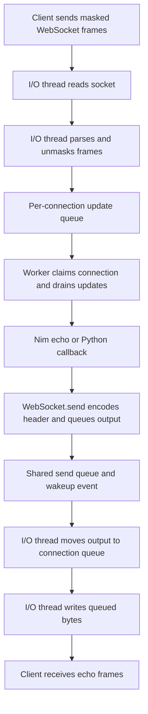

# Making PocketSocket Faster by Writing More per Turn

**Date:** 2026-09-06  
**Scope:** The bundled Mummy server's outbound socket path  
**Status:** Implemented and benchmarked on Linux; Windows fallback type-checked

PocketSocket had an uncomfortable result: startup was fast, but a server with a
native Nim message path was losing an echo-throughput benchmark to aiohttp.

It was tempting to blame the threading model. PocketSocket has an I/O thread,
a worker pool, and queues between them. Surely moving a message through all of
that machinery was the explanation?

Some of that machinery does cost time. But before replacing the architecture,
we found something much more local: **the writer sent either a frame header or
its payload, once per writable event, then returned to the selector.**

Even when many complete replies were already queued, the I/O loop handled
them in very small pieces. The new implementation gathers buffers into a
`sendmsg` call and makes bounded progress before returning to the event loop.

In a five-run, same-host comparison, pure-Nim echo throughput changed from
74,406 to 286,288 messages/sec at 64 bytes: **3.85 times the baseline**. At
1 KiB it improved by **2.06 times**. The Python callback path benefited too,
although less dramatically.

This article explains the mechanism, not just the number. The important part
is learning to recognize this kind of work amplification, and then changing
it without losing bytes, breaking ordering, or starving other connections.

## Contents

1. [What we measured](#1-what-we-measured)
2. [Following an echo through the framework](#2-following-an-echo-through-the-framework)
3. [What the old writer actually did](#3-what-the-old-writer-actually-did)
4. [The hypothesis and the experiment](#4-the-hypothesis-and-the-experiment)
5. [Vectored I/O without changing the protocol](#5-vectored-io-without-changing-the-protocol)
6. [Three functions and their responsibilities](#6-three-functions-and-their-responsibilities)
7. [A worked partial-write example](#7-a-worked-partial-write-example)
8. [Backpressure is not a disconnected client](#8-backpressure-is-not-a-disconnected-client)
9. [Fairness and readiness notifications](#9-fairness-and-readiness-notifications)
10. [Close frames, HTTP, and ownership](#10-close-frames-http-and-ownership)
11. [What the results tell us](#11-what-the-results-tell-us)
12. [How we tested correctness](#12-how-we-tested-correctness)
13. [What we deliberately did not change](#13-what-we-deliberately-did-not-change)
14. [Reproducing and extending the experiment](#14-reproducing-and-extending-the-experiment)
15. [Lessons worth carrying forward](#15-lessons-worth-carrying-forward)

## 1. What We Measured

The starting point was the [August comparison](../results/benchmarks/2026-08-14/2026-08-14-compare.txt).
It compared minimal echo handlers driven by the same raw-socket client. Startup
and connection establishment looked good; steady-state throughput did not.

There are two PocketSocket modes that matter here:

| Mode | What happens for each application message |
| --- | --- |
| `ps-nim-echo` | A Nim handler queues the payload back to its sender; no Python callback is registered. |
| `ps-hook-echo` | A Nim worker calls Python; the callback calls `ps.send()` to queue the reply. |

The distinction is important. If the no-Python path is slow, optimizing Python
argument conversion cannot be the whole answer. Conversely, improving the
shared writer should help both paths, without necessarily helping them equally.

We did not use the August numbers as the before side of this change. We built
the unchanged native extension again and collected a fresh baseline on the
same host used for the after run.

### Throughput is not latency in disguise

The throughput workload sends a batch of 256 prebuilt frames, receives 256
echoes, and repeats. Frames are constructed outside the timed loop, so Python's
client-side masking work is not included in the measured interval.

The client waits for the echoes. This is not a measurement of how quickly it
can fill its own kernel send buffer. It still measures an entire loopback
client/server exchange, not isolated server CPU execution.

The latency workload is different: send one frame, wait for its echo, repeat.
It has only one message in flight. A change can improve batched throughput a
great deal while improving one-at-a-time latency only modestly.

Also, neither workload answers how the server scales across many connections
or cores. One busy WebSocket is a useful experiment, not a complete capacity
model for the application.

## 2. Following an Echo Through the Framework

The public API is not where socket bytes are written. That work belongs to
the bundled [Mummy implementation](../server/src/mummy.nim).

Here is the path in broad terms:



There are three different queues in this story. Mixing them together makes
performance discussions harder than they need to be.

**The inbound WebSocket update queue** contains events waiting for a handler.
Workers coordinate through `websocketQueuesLock` and `websocketClaimed`. A
worker claims a connection and processes its queued updates serially. Different
connections can be handled by different workers; one connection's callbacks
are not spread across multiple workers at the same time.

**The shared send queue** carries output submitted by handlers to the I/O
thread. `WebSocket.send()` takes `sendQueueLock`, appends an `OutgoingBuffer`,
and triggers the send event when the shared queue transitions from empty to
nonempty. It does not synchronously transmit the message to the client.

**The per-connection output queue** belongs to the I/O thread. Once shared
output has been routed to its connection, `dataEntry.outgoingBuffers` holds
the buffers that the socket writer will consume.

That last queue is the focus of this change.

### Where epoll fits

On Linux, Nim's selector backend uses epoll to report readiness. In this
server, one I/O loop owns the selector and the socket I/O. Worker threads
communicate with it through queues and wakeup events.

This is not a design where all workers call `epoll_wait` on a shared epoll
instance and compete to handle the same socket. There is shared state and
synchronization, but "shared epoll contention" is not a precise description
of the code we changed.

Nor does being outside the GIL mean every native operation runs in parallel.
Parsing and socket I/O still run on this one I/O thread. Worker execution can
overlap with that thread, but adding workers does not create additional I/O
loops.

The [GIL investigation](bug/GIL_THREADING_FIX.md) explains why Python callbacks
must acquire the GIL and why the blocking server call must release it. Those
correctness rules remain intact. This optimization does not change Python
thread attachment, callback lifetime, or lock ordering.

## 3. What the Old Writer Actually Did

An `OutgoingBuffer` contains two strings and an offset:

```nim
buffer1, buffer2: string
bytesSent: int
```

For a normal WebSocket data frame, `buffer1` is the encoded frame header and
`buffer2` is the payload. Keeping them separate is reasonable: there is no
need to copy a large payload just to prepend a few header bytes.

The old writable-event branch was effectively this pseudocode:

```text
take the first queued output buffer
if its header is not finished:
    send the remaining header
else:
    send the remaining payload
record progress
return to the event loop
```

A later `afterSend` pass removed the buffer if it was complete and disabled
write interest if the queue had become empty.

For an ordinary nonempty echo, even if the socket accepted every requested
byte, the sequence was:

```text
writable event: send header A
writable event: send payload A
writable event: send header B
writable event: send payload B
...
```

The header and payload of a single frame required at least two send calls and
separate selector-loop iterations. Partial writes could require more.

Those iterations do not necessarily involve sleeping. A still-writable socket
can make the selector return immediately. They also do not necessarily imply
an OS thread context switch. But there is still repeated readiness processing,
queue inspection, branching, and entry into the kernel.

Likewise, two send calls do not guarantee two TCP packets. TCP and the kernel
decide segmentation; the API calls do not define packet boundaries. The
problem we can establish from the code is small units of application work per
send call and per writable event, not an exact packet-count claim.

For 256 already-queued, nonempty frames, the old writer needed at least 512
send calls. That is a lot of fixed overhead around a workload whose handler
mostly says "send these bytes back."

Nim can compile that control flow efficiently. It cannot automatically merge
observable socket operations or invent a different event-loop policy.

## 4. The Hypothesis and the Experiment

The local hypothesis was:

> Small output operations and repeated trips through the selector loop are
> materially limiting echo throughput. Gathering existing buffers and draining
> more output per writable event should improve throughput without changing
> worker scheduling or the public API.

That hypothesis makes useful predictions. Small messages should benefit most
from reducing fixed per-message overhead. Both echo modes should benefit
because both use the same writer. Large messages may benefit less if their
cost is increasingly elsewhere.

It is also falsifiable. If the same release workload showed little or no
improvement after this change, we would need to reconsider whether output
granularity was important on that host.

We changed the writer, then reran the same benchmark. We did not change the
worker count, optimize the parser, replace the allocator, bypass the callback
API, or move handlers onto the I/O thread.

One qualification matters: this experiment combines **vectored writes** and
**bounded draining**. It shows the effect of that combined writer change. It
does not isolate how much of the gain belongs to each mechanism. A three-way
comparison with scalar draining as the middle implementation would be needed
to separate those contributions.

## 5. Vectored I/O Without Changing the Protocol

Normally, `send()` takes one address and a length. Vectored I/O takes a list
of addresses and lengths. On Linux, an element of that list is an `iovec`:

```text
address of bytes | number of bytes
```

For two queued WebSocket frames, we can describe:

```text
vector 0: header A
vector 1: payload A
vector 2: header B
vector 3: payload B
```

The kernel consumes the vectors in order as one logical sequence of bytes.
The payload strings can stay where they already are.

### Why sendmsg rather than writev?

Both can express scatter/gather output. The implementation uses `sendmsg`
because its flags parameter lets Linux receive `MSG_NOSIGNAL` on the same
operation. A disconnected peer must become a socket error, not a `SIGPIPE`
that can terminate the whole server process.

The core call is:

```nim
var message: Tmsghdr
message.msg_iov = vectors[0].addr
message.msg_iovlen = vectorCount.csize_t
result = clientSocket.sendmsg(message.addr, MSG_NOSIGNAL)
```

This uses Nim's existing POSIX declarations. No new native dependency or
custom C ABI declaration was necessary.

### This is not zero-copy networking

The optimization avoids constructing a new contiguous application string
containing every header and payload. It does not request kernel zero-copy
transmission. Ordinary `sendmsg` still generally copies data into kernel
socket buffers.

The useful claim is "fewer calls and no extra application-level concatenation
buffer," not "no copies."

### TCP bytes are not WebSocket messages

TCP exposes an ordered byte stream. WebSocket frame boundaries are described
by the frame headers carried in that stream, not by the number of send calls.

Writing three encoded frames together does not turn them into one WebSocket
frame. Writing a header in two pieces does not turn it into two frames either.
The receiver parses the same sequence of headers and lengths.

This gives us freedom to change write granularity while preserving the
application-visible protocol exactly.

### The batching is opportunistic

The server does not wait for eight frames to arrive before sending. It gathers
whatever is already in the connection's output queue when the socket gets its
turn. A single queued message can have its header and body sent together.

There is no batching timer or minimum batch size introducing an intentional
wait. A queue filled by the worker during an earlier part of the loop simply
offers more work to combine.

## 6. Three Functions and Their Responsibilities

The new code separates three concerns that used to be spread between the
writable branch and `afterSend`.

### writePending: describe and attempt the next bytes

`writePending` builds a bounded list of vectors from the current queue. It
starts from each buffer's existing `bytesSent` offset and includes only bytes
that have not already been accepted by the socket.

The starting offsets are:

```nim
let headerOffset = min(outgoingBuffer.bytesSent, outgoingBuffer.buffer1.len)
let bodyOffset = max(0, outgoingBuffer.bytesSent - outgoingBuffer.buffer1.len)
```

If we are partway through the header, the header vector begins there and the
body vector begins at zero. If the header is finished, it contributes no
vector, and the body begins at its remaining offset.

Each vector is also clipped to the remaining byte budget. Collection stops
when it reaches the vector limit, exhausts that budget, or includes output
marked `closeConnection`.

This function returns the syscall result. It does **not** pop the queue or
advance `bytesSent`. Describing data we would like to write is not evidence
that the socket accepted it.

### consumeWritten: account for confirmed progress

`consumeWritten` takes the positive byte count returned by the socket and
walks the queue from the front.

For each output buffer, its remaining length is:

$$
\text{pending} = \lvert\text{header}\rvert + \lvert\text{payload}\rvert - \text{bytesSent}
$$

If the accepted byte count covers the entire remaining buffer, the function
removes that buffer and continues with the next. Otherwise it increments the
front buffer's offset and stops.

Notice the unit: a byte count, not a frame count. A successful `sendmsg` can
finish several frames and stop midway through another one.

The initial `consumeWritten(0)` call in `drainWrites` also removes zero-length
completed entries at the front. This prevents the next send attempt from
trying to transmit an already-complete buffer. A WebSocket with an empty
payload is not a zero-byte output: it still has a header to send.

### drainWrites: decide how long this socket gets to work

`drainWrites` coordinates the two functions, handles errors, and enforces the
per-event limits. Its essential control flow is:

```text
retire any already-complete front entries
repeat while call budget remains:
    stop if queue is empty or byte budget is exhausted
    attempt a bounded write
    handle retryable or terminal errors
    subtract the accepted bytes from the budget
    consume exactly those bytes from the queue
    stop if a connection-closing output completed
```

Its Boolean result means **close this connection**, not "all output was sent."
A `false` result may mean the queue drained, the socket became backpressured,
or the fairness budget ran out. The caller distinguishes those cases where
needed by inspecting whether the output queue is empty.

The event loop now calls this function directly. The old `sentTo` list and
separate `afterSend` pass are no longer needed, because output accounting
happens after each successful write, before constructing the next vectors.

## 7. A Worked Partial-Write Example

Imagine two outputs queued like this. The strings are illustrative bytes,
not actual encoded WebSocket headers:

```text
A: header "HEAD"  payload "body"    total 8 bytes
B: header "NEXT"  payload "data"    total 8 bytes
```

Suppose the first syscall accepts only two bytes. It accepted `HE`, not the
whole header. The queue still contains both outputs:

```text
A.bytesSent = 2
next vectors: "AD", "body", "NEXT", "data"
```

The next syscall accepts three bytes: `ADb`. A's header is now complete and
one payload byte has been accepted:

```text
A.bytesSent = 5
next vectors: "ody", "NEXT", "data"
```

The next syscall accepts five bytes: `odyNE`. Accounting consumes A's final
three bytes, removes A, and applies the remaining two bytes to B:

```text
A removed
B.bytesSent = 2
next vectors: "XT", "data"
```

A final six-byte write empties the queue. The receiver sees exactly:

```text
HEADbodyNEXTdata
```

Nothing is resent. Nothing is skipped. No assumption was made that the kernel
stopped on a header, payload, or frame boundary.

This is the central correctness obligation of the optimization. Sending more
buffers at once is easy; mapping an arbitrary accepted prefix back onto the
original queue is what makes it safe.

One invariant helps reason about it: after accounting, the front buffer is
the first unfinished output, and every later buffer is still untouched. The
writer must never advance an offset based on the requested length instead of
the returned length.

## 8. Backpressure Is Not a Disconnected Client

A nonblocking socket does not promise to accept everything we hand it. Its
send buffer has finite capacity. The receiving application may be slow, the
network may be congested, or there may simply be more output than currently
fits.

That situation is normal. Correct output code needs more than a
"positive means success, everything else means close" branch.

| Result | Meaning for this writer | Action |
| --- | --- | --- |
| Positive byte count | This prefix was accepted by the local socket. | Account for exactly that prefix; continue within the budget. |
| `EAGAIN` or `EWOULDBLOCK` | No more output can be accepted now. | Keep queued bytes and write interest; return to the event loop. |
| `EINTR` | This call was interrupted without reporting accepted bytes. | Retry within the syscall-attempt budget. |
| Other negative result | A terminal error for this writer. | Request connection cleanup. |
| Zero for a nonempty request | No progress was made. | Request cleanup rather than spin indefinitely. |

Windows uses the corresponding Winsock error codes for interruption and
would-block handling.

The old writable branch treated all nonpositive results as connection failure.
The new code explicitly distinguishes temporary backpressure. A loop that
continues writing is much more likely to encounter `EAGAIN`, so this is not an
optional refinement added after the optimization. It is part of making
draining correct.

An `EINTR` retry does not consume bytes, but it does consume one attempt from
the call budget. Repeated interruptions therefore cannot keep this function
running forever.

There is another distinction worth keeping: "accepted by the socket" does
not mean "received and processed by the remote application." A successful
send permits us to release or reuse our ordinary application buffer; it is
not an application-level acknowledgement. The echo benchmark waits for the
reply on the client precisely because a send completion alone is insufficient.

## 9. Fairness and Readiness Notifications

Once writing more in one turn helps, why not drain an arbitrarily large queue
before doing anything else?

Because the I/O thread has other jobs. It must read incoming traffic, accept
connections, process wakeups and shutdown, and write to other clients. One
productive socket can monopolize that thread just as effectively as one slow
operation can.

The implementation uses three limits:

```nim
maxWriteBytesPerEvent = 256 * 1024
maxWriteCallsPerEvent = 16
maxWriteVectors = 16
```

**The byte budget** caps accepted output per socket turn, including headers.
Without it, large payloads could make one visit move an excessive amount of
data.

**The call budget** caps syscall attempts. Without it, a stream of tiny partial
writes or repeated interruptions could consume lots of time while remaining
under the byte limit.

**The vector limit** bounds the temporary descriptor array and how much queue
inspection one write attempt performs. Sixteen is a deliberately small bound,
not a claim that sixteen is the kernel's maximum or the optimal tuning value.

For ordinary frames with a nonempty header and payload, sixteen vectors can
describe eight complete frames. With all output available and every syscall
accepting its full request, sixteen calls can send 128 such frames per turn,
unless the byte limit stops it sooner.

Under those ideal conditions, 256 small queued frames could need 32 send calls
instead of at least 512, and about two writable turns instead of at least 512.
That is an explanatory upper-bound example, **not a traced syscall count from
the benchmark**. Real queue occupancy, short writes, and worker timing change
the actual ratio.

### Why pending output is not stranded

The loop uses read-and-write interest while output remains. If draining empties
the queue, it changes interest back to read-only. If it stops at a budget or
would-block result, write interest stays enabled.

This relies on the current level-triggered readiness model: a socket that
remains writable can be reported again even if we voluntarily stopped before
`EAGAIN`.

That detail is easy to miss in a future refactor. With edge-triggered epoll,
stopping early while the socket is still writable does not necessarily produce
another edge. An edge-triggered version would need an explicit continuation
mechanism or a different draining policy. Do not copy these budgets into an
edge-triggered loop without also designing how unfinished work gets scheduled.

The budgets are a scheduling safeguard, not a proof of equitable service.
They do not bound queue memory, impose a wall-clock deadline, or guarantee
latency for a quiet connection sharing the loop with many busy ones. That
requires a mixed-load fairness test.

## 10. Close Frames, HTTP, and Ownership

### Closing is a byte-stream boundary

Some output entries have `closeConnection` set. The new vector collector must
not send bytes from entries after one of those outputs, even if they happen
to be present in the queue.

Consider this deliberately defensive test arrangement:

```text
"before" -> "close" [closeConnection] -> "never"
```

The kernel must see `beforeclose`, not `beforeclosenever`. Vector collection
includes the closing entry but stops before its successor. Accounting requests
cleanup only once the closing entry's remaining bytes have been accepted.

`isCloseFrame` and `closeConnection` are different flags. Sending a WebSocket
close frame can begin a handshake in which the server still waits for the
peer. `isCloseFrame` records completion of that frame; `closeConnection` tells
the writer when completion should lead to transport cleanup. The optimization
preserves that distinction rather than treating every close frame as an
immediate socket close.

### HTTP uses the same writer

Despite the WebSocket motivation, this is not an echo-only fast path. HTTP
responses also use the output queue. The HTTP upgrade response must precede
any WebSocket bytes. A response marked to close the connection must finish
before cleanup is requested.

The existing routing, upgrade waiting list, and queue order are unchanged.
Gathering may place an HTTP upgrade and subsequent bytes in the same kernel
write, but it cannot reverse their order. The client must already be able to
handle bytes arriving together because TCP never promised separate reads.

That shared behavior is why validation includes HTTP keep-alive and
connection-close responses, not just echo frames.

### Pointer lifetime is part of the design

An `IOVec` does not own the bytes at `iov_base`. It merely borrows their address.
That creates an obligation: the corresponding Nim strings must remain alive
and stable until `sendmsg` returns.

The per-connection output queue holds the `OutgoingBuffer` references while
vectors are built and submitted. Queue entries are only consumed afterward,
using the returned byte count. Workers append to the separate shared send
queue; they do not mutate the I/O thread's per-connection queue while its
vectors are in use.

Nonblocking here does not mean that `sendmsg` retains these pointers for an
asynchronous callback. It returns synchronously with a count or error. This
is ordinary socket output, not a zero-copy completion API with additional
buffer-lifetime requirements.

The approach therefore fits the existing ownership model without adding
another lock around the syscall.

## 11. What the Results Tell Us

The [focused runner](../utils/benchmarks/bench_write_path.py) reused the existing
server definitions and workload functions. The experiment used:

- Linux on the same two-CPU host for both phases.
- Python 3.12.1 and Nim 2.2.10, with a release extension, ARC, and existing build settings.
- The default worker-count configuration in both phases.
- Five samples per target and payload, rotating target order between repetitions.
- A fresh server for each repetition/target/payload combination, running throughput then latency on separate connections.
- 100,000 messages per throughput sample at 64B and 1 KiB; 12,000 at 16 KiB.
- 2,000 measured round trips per latency sample, and 200 warmups per workload.
- aiohttp rerun as a control in both phases.

The table uses medians of the five throughput rates:

| Path | Payload | Before msg/s | After msg/s | Ratio |
| --- | --- | ---: | ---: | ---: |
| Pure Nim | 64B | 74,406 | 286,288 | 3.85x |
| Pure Nim | 1 KiB | 52,938 | 109,243 | 2.06x |
| Pure Nim | 16 KiB | 19,912 | 22,616 | 1.14x |
| Python hook | 64B | 40,493 | 51,134 | 1.26x |
| Python hook | 1 KiB | 36,485 | 48,305 | 1.32x |
| Python hook | 16 KiB | 15,292 | 18,848 | 1.23x |
| aiohttp control | 64B | 97,973 | 102,958 | 1.05x |
| aiohttp control | 1 KiB | 72,724 | 79,921 | 1.10x |
| aiohttp control | 16 KiB | 48,180 | 46,989 | 0.98x |

The pure-Nim path now exceeds aiohttp at 64B and 1 KiB in this experiment.
It still trails aiohttp at 16 KiB. The callback path improves but remains below
aiohttp at every measured size.

### Why small messages benefit most

Every send operation carries fixed costs around the payload: entering the
kernel, traversing socket code, handling readiness, and bookkeeping in the
server. With a small frame, those costs can be large relative to the byte work.
Batching amortizes them across several frames.

With larger payloads, more time goes into work that this patch did not remove:
receiving, unmasking, copying, kernel transfer, and parsing replies on the
client. This is a coherent explanation for diminishing gains with payload
size. It is not a profile proving which of those costs dominates the 16 KiB
case.

The strongest measured conclusion is narrower: output granularity was a
substantial constraint on the small-message pure-Nim workload.

### Why the Python path benefits less

The Python echo path still acquires the GIL, creates Python-facing arguments,
invokes the handler, and returns through `ps.send()`. A faster socket writer
does not make those operations disappear. It may also see different queue
occupancy because replies arrive from the handler at a different rate.

This is consistent with Amdahl's law. In an idealized serial cost model, if a
fraction $f$ of the work is accelerated by a factor $s$, overall speedup is:

$$
S = \frac{1}{(1-f) + f/s}
$$

The formula is useful intuition, not a fitted model of this concurrent server.
Queueing and overlap make the real system more complicated. We cannot infer
the exact GIL cost by subtracting these throughput numbers.

### Latency did not improve everywhere

Pure-Nim round-trip results, in microseconds:

| Payload | Before p50 | After p50 | Before p99 | After p99 |
| --- | ---: | ---: | ---: | ---: |
| 64B | 55.5 | 49.9 | 84.5 | 67.1 |
| 1 KiB | 56.8 | 52.4 | 71.7 | 84.3 |
| 16 KiB | 78.7 | 74.6 | 131.1 | 157.3 |

These are medians of each run's percentile values, not percentiles calculated
from one pooled set of all round trips.

The p50 improved at every size, which is consistent with no longer separating
a lone frame's header and body into different writable turns. But p99 rose at
1 KiB and 16 KiB. We should report that, not bury it under the throughput gain.

Longer output turns can create scheduling tradeoffs, but these runs do not
establish that as the cause of the higher p99. The latency workload itself
has only one message in flight. Shared-host scheduling and run variance are
also possible explanations. Longer, repeated mixed-load tests are needed to
distinguish them.

### Measurement limits

The aiohttp control's medians changed by up to about 10% between phases. These
were not perfectly stationary conditions. Before and after were separate
phases, not interleaved trials of both binaries.

The after-change pure-Nim 16 KiB samples ranged from 15,412 to 24,185 msg/s.
Its 1.14x median is worth recording, but not presenting as a stable 14% gain
that every deployment should expect.

The runner also measured an in-memory client parse ceiling of approximately
859k, 558k, and 271k frames/sec for the three sizes. Those values are above the
measured network rates. They help reject a simple "the parser alone caps us
at this exact rate" explanation, but do not eliminate client overhead or
competition for CPU between client and server.

We did not capture syscall counts, hardware counters, or CPU profiles in this
experiment. We verified the changed control flow and observed its end-to-end
effect. Claims about exact syscall reductions, allocator costs, or time spent
in epoll would require additional measurements.

The raw evidence is preserved in [baseline.json](../results/benchmarks/2026-09-06-write-path/baseline.json)
and [vectored-drain.json](../results/benchmarks/2026-09-06-write-path/vectored-drain.json),
with a shorter [experiment report](../results/benchmarks/2026-09-06-write-path/README.md).
Later benchmark campaigns are separate datasets, not silently substituted
into this before/after comparison.

## 12. How We Tested Correctness

A benchmark that counts replies is not enough to validate a byte-stream
optimization. If every request contains the same repeated payload, some forms
of corruption or reordering can be hard to notice.

The validation therefore has several layers.

### Byte accounting without the network

The [Nim writer tests](../server/tests/test_write_path.nim) include the
implementation to exercise its private helpers without expanding the public
API. They check partial header progress, partial body progress, and a returned
byte count that crosses from one output into the next.

This isolates the bookkeeping from OS behavior. We can choose exact boundaries
instead of hoping the kernel happens to return a particular short write.

### Real nonblocking sockets

The Linux tests use `socketpair` with nonblocking endpoints. This is a useful
way to exercise actual kernel buffer limits without involving HTTP upgrades
or a listening TCP server.

One test reduces the sender's socket buffer, queues a patterned 1 MiB payload,
and initially does not drain the receiving side. It verifies that some output
is accepted, a subsequent attempt makes no progress without closing, and the
queued offset remains unchanged. It then drains the peer and resumes writes,
checking the final bytes against the complete expected sequence.

Other cases verify multi-frame gather order, an empty payload, stopping at a
connection-close boundary, deliberately truncated vector requests, bounded
draining, and a closed peer without process termination from `SIGPIPE`.

There are nine focused tests in total. Their names should not be mistaken
for broader guarantees: the byte-budget test checks positive progress bounded
by the limit, not that every kernel accepts exactly 256 KiB before yielding.
The syscall-budget test checks queued work remains after a bounded turn; it
does not measure service fairness between real clients.

### Real HTTP and WebSocket connections

The [wire-level integration test](../utils/benchmarks/test_write_path.py) starts
the locally built extension and runs four concurrent clients through each
echo mode. It checks frame opcodes and exact ordered payloads, including empty
frames, text and binary frames, and payloads around header-length boundaries
and up to roughly 65 KB. It also checks close replies and that the server
remains alive.

HTTP checks exercise repeated requests on a connection and a response that
closes it, validating body length and content consistency. This catches
mistakes in the shared writer that a WebSocket-only test could miss.

### Broader gates and honest gaps

The full Nim test suite passed, with five pre-existing skips. The new Python
files passed syntax checks. The Windows path passed semantic checking with
`nim check --os:windows --cpu:amd64`.

The vectored fast path is Linux-specific. Other platforms keep scalar sends
with bounded draining and platform-specific retryable-error handling. Windows
runtime behavior was not tested, nor were other operating systems. The
Windows check caught and led to correction of the Nim binding name
`wsaGetLastError`; a Linux-only compile would not have caught that error.

There was no deterministic signal-injection test for `EINTR`, no full protocol
conformance run as part of this focused change, and no long-duration slow-client
or overload campaign. The test evidence is substantial, but it has boundaries.

## 13. What We Deliberately Did Not Change

Keeping the experiment local made both the result and the risks easier to
understand. Several plausible improvements remain separate questions.

**Worker scheduling.** Updates can enqueue redundant tasks before a worker
claims a connection. Removing those tasks may help, but requires preserving
the no-lost-wakeup and per-connection serialization rules. It was not part of
this patch.

**Receive-side work.** The parser still unmasks and copies payload data and
compacts remaining input after frames. Larger-message profiling should inspect
this path, without assuming it is the next bottleneck just because the code
looks expensive.

**Repeated write-interest updates.** Moving frames from the shared send queue
still calls the existing selector update path. We did not add deduplication
of interest updates or measure their syscall cost.

**The GIL bridge.** Python callbacks retain their existing GIL protection,
marshalling contract, and exception handling. Native throughput exceeding
callback throughput is not evidence that those correctness mechanisms should
be removed.

**Per-core I/O loops.** One I/O thread can eventually become a scalability
limit, especially across many active connections. That is a different
experiment involving connection ownership, cross-loop sends, and broadcast.
It was unnecessary to answer whether the current writer was wasting work.

**End-to-end flow control.** Correct handling of `EAGAIN` keeps unsent bytes
queued; it does not stop producers from adding more. A per-turn byte budget
is not a queue-size limit. Sustained overload and slow receivers still need
an explicit policy for memory growth and producer backpressure.

The optimization changes how efficiently existing queued work is sent. It
does not claim to solve every performance or resource-management issue in
the server.

## 14. Reproducing and Extending the Experiment

From the repository root, with Nim dependencies and aiohttp available:

```sh
python3 server/compile.py pyd --release --no-setup
python3 utils/benchmarks/bench_write_path.py --label local --runs 5 -o /tmp/pocketsocket-write-path.txt
nim c -r -d:release --hints:off server/tests/test_write_path.nim
python3 utils/benchmarks/test_write_path.py
```

Run the full Nim suite from the server directory:

```sh
cd server
nimble test -y --hints:off
```

The benchmark runner does not compile the extension. Rebuilding explicitly is
essential; otherwise it is possible to edit Nim source and benchmark the old
shared library without noticing.

To reproduce a before/after pair, preserve the two source states, build each
in turn with the same settings, and write results to distinct paths. Keep the
interpreter, client, worker count, payloads, and run counts unchanged. The
saved run metadata is useful but does not capture every dependency version or
a binary hash; record those too for a more rigorous future campaign.

The highest-value extensions would be:

1. Compare the original writer, scalar draining, and vectored draining to isolate the two mechanisms.
2. Count `send`, `sendmsg`, and selector syscalls on the server process in a separate profiling run. Tracing overhead makes those timings unsuitable as the primary throughput result.
3. Mix a saturated connection with a low-rate latency-sensitive client to test the fairness budgets.
4. Run many connections on a larger host before considering multiple I/O loops.
5. Profile the 16 KiB workload and the callback workload separately; their remaining limits may differ.
6. Exercise slow readers and queue growth over longer runs, rather than treating a successful short echo test as an overload guarantee.

These are proposed next experiments, not work already performed in this
write-path change.

## 15. Lessons Worth Carrying Forward

The useful discovery was not that threads are bad or that epoll is slow. It
was that an event loop can spend too much effort repeatedly rediscovering
that it is allowed to do work it already has queued.

The original representation, separate headers and payloads, was not itself
the problem. It became expensive because each piece required its own turn.
Vectored I/O let us keep that representation while changing the unit of work
presented to the kernel.

The performance improvement depended on correctness details: exact byte
accounting, pointer lifetime, close boundaries, retryable errors, and a way to
resume after voluntarily yielding. Those are not peripheral concerns around
the optimization. They are the optimization implemented properly.

Finally, the measurements changed the architectural conversation. We have
strong evidence that small-message output granularity mattered on this host,
without having rewritten the thread model. We also have clear evidence that
large-message throughput and tail latency deserve more work.

That is a useful place to end an experiment: the application is faster, the
mechanism is understandable, and the next questions are more specific than
the ones we started with.